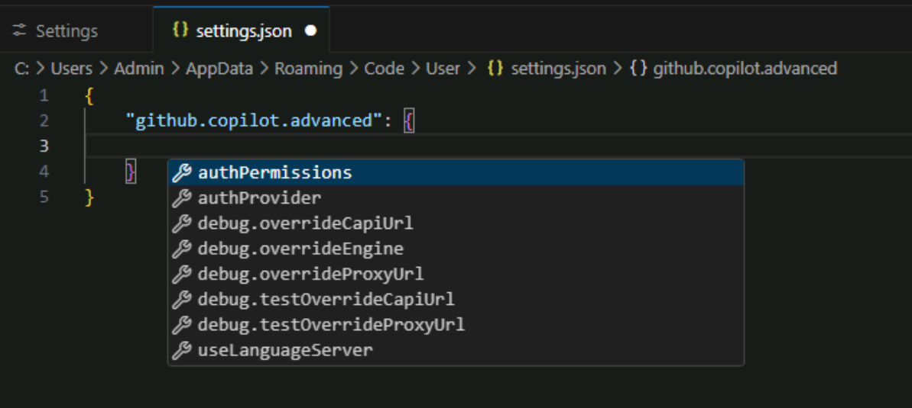
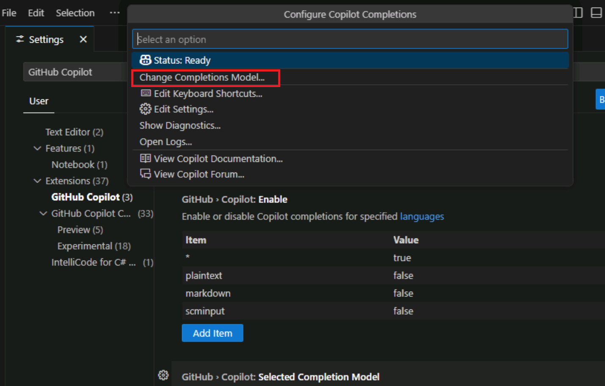
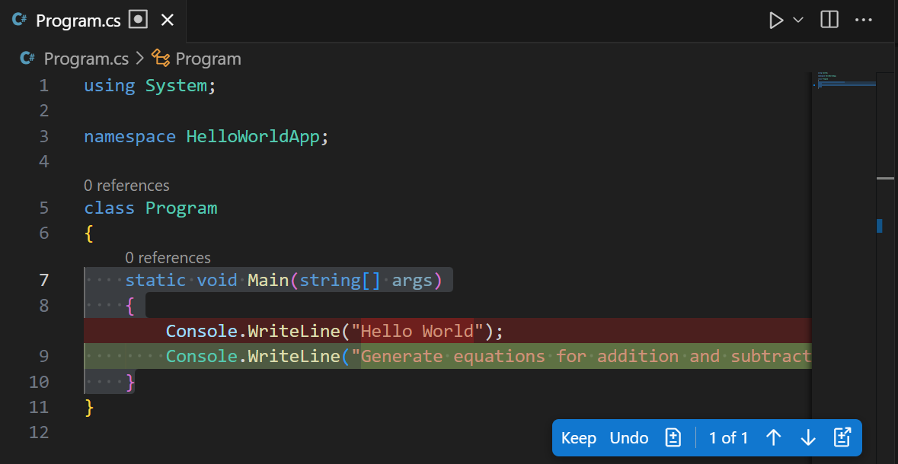
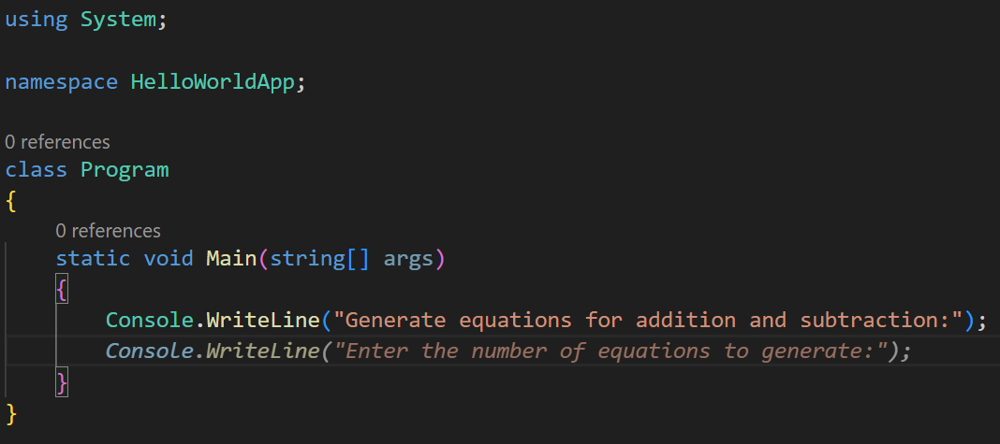
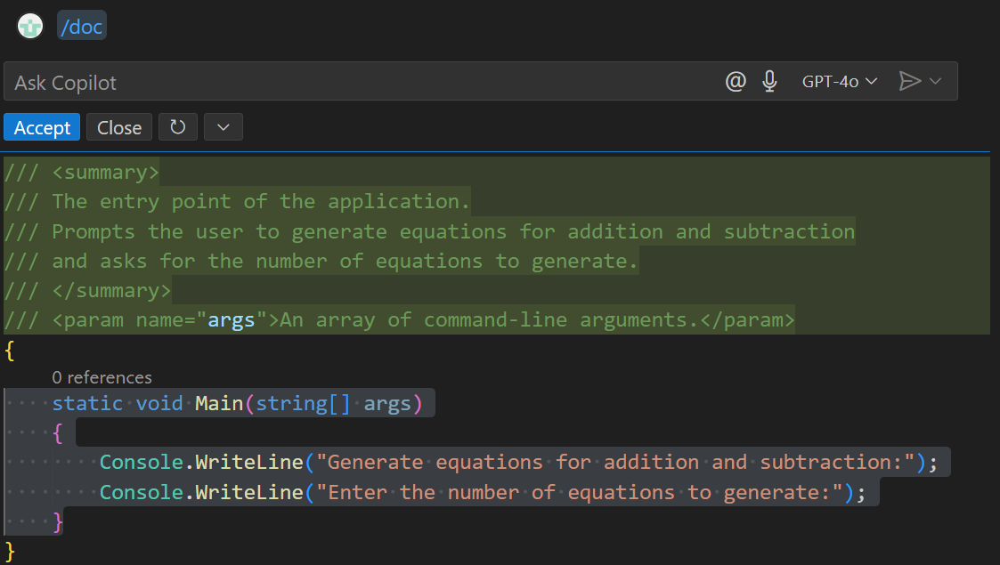

---
lab:
  title: 练习 - 了解 GitHub Copilot 设置和用户界面功能
  description: 了解如何配置 GitHub Copilot 设置以及如何访问 Visual Studio Code 中的 GitHub Copilot 功能。
---

# 了解 GitHub Copilot 设置和用户界面功能

Visual Studio Code 为开发人员提供无缝且可自定义的 GitHub Copilot 体验。 在本练习中，你将了解 GitHub Copilot 设置，并探索 Visual Studio Code 中的 GitHub Copilot 用户界面。

完成本练习大约需要 25 分钟****。

> **重要说明**：若要完成本练习，必须提供自己的 GitHub 帐户和 GitHub Copilot 订阅。 如果没有 GitHub 帐户，可以<a href="https://github.com/" target="_blank">注册</a>免费的个人帐户，并使用 GitHub Copilot 免费版计划来完成练习。 如果可以从实验室环境中访问 GitHub Copilot Pro、GitHub Copilot Pro+、GitHub Copilot Business 或 GitHub Copilot Enterprise 订阅，则可以使用你现有的 GitHub Copilot 订阅来完成本练习。

## 开始之前

实验室环境必须包括以下内容：

- Git 2.48 或更高版本
- .NET 或 Python：

    - .NET SDK 9.0 或更高版本，包含具有 C# 开发工具包扩展的 Visual Studio Code********。
    - Python 3.10 或更高版本，包含具有 Python 扩展的 Visual Studio Code********

- 启用了对具有 GitHub Copilot 的 GitHub 帐户的访问。

如果你将本地电脑用作本练习的实验室环境：

- 有关将本地电脑配置为实验室环境的帮助，请在浏览器中打开以下链接：<a href="https://go.microsoft.com/fwlink/?linkid=2320147" target="_blank">配置实验室环境资源</a>。

- 有关在 Visual Studio Code 中启用 GitHub Copilot 订阅的帮助，请在浏览器中打开以下链接：<a href="https://go.microsoft.com/fwlink/?linkid=2320158" target="_blank">在 Visual Studio Code 中启用 GitHub Copilot</a>。

如果你将在本练习中使用托管实验室环境：

- 有关在 Visual Studio Code 中启用 GitHub Copilot 订阅的帮助，请将以下 URL 粘贴到浏览器的网站导航栏中：<a href="https://go.microsoft.com/fwlink/?linkid=2320158" target="_blank">在 Visual Studio Code 中启用 GitHub Copilot</a>。

- 为了确保 .NET SDK 配置为使用官方 NuGet.org 存储库作为下载和还原包的源：

    打开命令终端，然后运行以下命令：

    ```bash

    dotnet nuget add source https://api.nuget.org/v3/index.json -n nuget.org

    ```

- 若要为 Python 配置托管实验室环境，请执行以下步骤：

    1. 若要确定在托管环境中安装的 Python 版本，请运行以下命令：

        ```bash
        python --version
        ```

        如有必要，请使用以下 URL 中的以下步骤在 Visual Studio Code 中配置 Python：<a href="https://code.visualstudio.com/docs/python/python-tutorial" target="_blank">VS Code 中的 Python 入门</a>。

    1. 使用 Visual Studio Code 中的“扩展”视图安装 Python 扩展。

## 练习场景

你是一名在当地社区 IT 部门工作的开发人员。 支持公共图书馆的后端系统在火灾中丢失。 你的团队需要开发临时解决方案，以帮助图书馆员工管理其操作，直到可以更换系统。 你的团队已选择使用 GitHub Copilot 来加速开发流程。

本练习包括以下任务：

1. 了解 Visual Studio Code 中的 GitHub Copilot 设置。
1. 探索 Visual Studio Code 中的 GitHub Copilot 用户界面。

## 了解 Visual Studio Code 中的 GitHub Copilot 设置

GitHub Copilot 设置拆分在 GitHub 帐户和 Visual Studio Code 环境中。 在 Visual Studio Code 中，设置用于配置 GitHub Copilot 和 GitHub Copilot 对话助手的行为。 在 GitHub 帐户中，设置用于管理 GitHub Copilot 订阅，配置提示和建议的保留，以及允许或阻止与公共代码匹配的建议。

### 在 Visual Studio Code 中启用或禁用 GitHub Copilot

激活计划时，默认情况下会启用 Visual Studio Code 中的 GitHub Copilot 扩展。 但如果需要，可以在 Visual Studio Code 中禁用 GitHub Copilot 一段时间。

请使用以下步骤完成本练习的这一部分：

1. 打开一个新的 Visual Studio Code 实例。

1. 在 Visual Studio Code 中，打开“扩展”视图****。

1. 在已安装的扩展列表中，向下滚动，直到找到 GitHub Copilot****。

1. 若要显示 GitHub Copilot 扩展的列出“启用”和“禁用”选项的下拉菜单，请选择 GitHub Copilot 扩展的齿轮图标。

    

如果要测试启用/禁用选项，可以选择禁用选项。 但是，在继续本练习之前，请务必重新启用 GitHub Copilot。

### 了解 GitHub Copilot 扩展的设置

在 Visual Studio Code 中激活 GitHub Copilot 时，系统会配置默认设置。 这些设置位于“扩展”标签下，其中包括用于 GitHub Copilot 和 GitHub Copilot 对话助手的设置。 可以使用 Visual Studio Code 的设置选项卡来自定义 GitHub Copilot 扩展的设置。

> **提示**：可以使用 Copilot 对话助手菜单打开针对 GitHub Copilot 筛选的“设置”选项卡。

请使用以下步骤完成本练习的这一部分：

1. 在 Visual Studio Code 的顶部菜单栏上，打开 Copilot 对话助手菜单。

    Copilot 对话助手菜单包括“配置代码补全”选项，该选项提供对 GitHub Copilot 设置筛选列表的访问权限****。

    

1. 在“Copilot 对话助手”菜单上，选择“配置代码补全”，然后选择“ 编辑设置”********。

1. 请花点时间查看 GitHub Copilot 设置的组织方式。

    

    请注意，GitHub Copilot 和 GitHub Copilot 对话助手的设置是分开的****。 另请注意“预览”和“实验”类别****。

1. 在“扩展”标签下，选择“GitHub Copilot”****。
  
    

    请注意，设置列表现在仅针对 GitHub Copilot 进行筛选。

    GitHub Copilot 扩展具有以下设置选项：

    - **GitHub.Copilot.Advanced**：在 settings.json 中为 GitHub Copilot 配置高级设置。

        选择“在 settings.json 中编辑”将打开 settings.json 文件，这是包含 GitHub Copilot 设置的 JSON 文件****。 这些设置分为多个部分，每个部分都包含设置列表。

        

    - **GitHub.Copilot.Enable**：启用或禁用指定语言的 Copilot 补全功能。

        术语“语言”指编程语言，但也适用于其他文件格式**。 使用语言列表和“true”或“false”值指定语言，以便为每种语言启用或禁用 GitHub Copilot********。 默认情况下，为所有语言启用 GitHub Copilot。 在第一行使用通配符 **\*** 和值 **true** 指定此设置。 后续行指定为哪些语言启用或禁用 GitHub Copilot。 例如，为 C#、JavaScript 和 Python 启用了 GitHub Copilot，而为 Plaintext 和 Markdown 禁用了 GitHub Copilot********************。

        

    - **GitHub.Copilot.SelectedCompletionModel**：选择要用于 Copilot 补全的模型。

        要选择补全模型，请打开“配置 Copilot 补全”菜单，然后选择“更改补全模型”菜单选项****。

        

        模型列表可能受到以下限制：GitHub Copilot 订阅、区域中的可用模型以及组织的可用模型。

        

1. 在“启用或禁用指定语言的 Copilot 完成”下，选择“markdown”********。

    Markdown 的默认值设置为“false”****。 这意味着对 Markdown 文件禁用 GitHub Copilot 补全。

1. 要为 Markdown 文件启用 Copilot，请选择“编辑项”（铅笔图标），选择“false”，将值更改为“true”，然后选择“确定”****************。

    现在可以使用 GitHub Copilot 帮助创作或更新 Markdown 文件。 例如，在处理项目文档时，GitHub Copilot 可以生成代码补全建议。

1. 在“扩展”标签下，选择“GitHub Copilot 对话助手”。

    

    GitHub Copilot 对话助手扩展包含大量可用设置，并且会定期更新。 GitHub Copilot 对话助手扩展还包括预览和实验性设置，这些设置可能会更改，并且可能停用。 预览和实验性设置包含在列表末尾，并具有“预览”或“实验性”标记********。

    

1. 请花几分钟时间查看 GitHub Copilot 对话助手的设置。

    我们建议在此培训期间保留默认设置。 这有助于确保在练习中获得预期体验。 完成培训后，可以尝试使用这些设置来自定义自己的 GitHub Copilot 和 Copilot Chat 体验。

1. 关闭“设置”选项卡。

## 浏览 Visual Studio Code 中的 GitHub Copilot 用户界面

Visual Studio Code 将 GitHub Copilot 的 AI 功能无缝集成到开发环境中。

GitHub Copilot 功能分为以下类别：

- 自然语言聊天：GitHub Copilot 提供三个不同的聊天界面：聊天视图、快速聊天和内联聊天。

- 代码补全：GitHub Copilot 与代码编辑器集成，可在键入时生成上下文感知代码补全建议。

- 智能操作：GitHub Copilot 使用智能操作自动执行常见任务，以避免重复的提示写入。

GitHub Copilot 的高效工作功能易于访问并无缝集成到工作流中，无需中断编码体验。

### 了解聊天视图功能

请使用以下步骤完成本练习的这一部分：

1. 要打开聊天视图，请选择“切换聊天”按钮****。

    “切换聊天”按钮位于 Visual Studio Code 窗口顶部，在搜索文本框右侧。

    

    GitHub Copilot 聊天视图将在 Visual Studio Code 窗口右侧的侧栏窗口中打开。

1. 请花几分钟时间查看聊天视图界面。

    

    从顶部开始向下移动，聊天视图依次包括以下界面元素：

    - 聊天视图工具栏：聊天视图工具栏位于聊天视图的右上角。 可以使用工具栏管理聊天历史记录、启动新聊天、在其他位置打开聊天视图或隐藏聊天视图。 将鼠标指针悬停在工具栏按钮图标上可查看说明。

    - 聊天响应区域：聊天响应区域是 GitHub Copilot 在聊天视图工具栏下方用于显示响应的空间。 响应包括代码建议、说明、交互式元素以及与提示相关的其他信息。

    - “添加上下文”按钮：“添加上下文”按钮位于聊天视图的底部。 可以使用此按钮搜索向聊天会话添加上下文的资源。 这些资源可以来自内部项目文件，也可以来自 GitHub 上的公共存储库（在组织外部）。

    - 要求 Copilot：“要求 Copilot”文本框是输入提示的地方。 可以使用“询问 Copilot”文本框向 GitHub Copilot 询问有关代码库的问题、请求代码建议或请求特定任务的帮助。

    - “与扩展聊天”按钮：“与扩展聊天”按钮位于“要求 Copilot”文本框下方。 GitHub Copilot 扩展是一种 GitHub Apps，可将外部工具的强大功能集成到 GitHub Copilot 对话助手。 可以使用此按钮从 Copilot 扩展列表中进行选择。 默认扩展提供聊天参与者和 / 命令的组合，这些命令为提示提供上下文。

        > 注意****：使用 Copilot Pro、Copilot Pro+ 或 Copilot Free 计划的任何用户都可以使用 Copilot 扩展。 对于具有 Copilot Business 或 Copilot Enterprise 计划的组织或企业，组织所有者和企业管理员可以授予对 Copilot 扩展的访问权限。 Copilot 扩展不适用于 GitHub Enterprise Server。

    - “开始语音聊天”按钮：“开始语音聊天”按钮位于“询问 Copilot”文本框下方。 可以使用此按钮来启用或禁用与 GitHub Copilot 的语音交互。 启用语音交互后，可以使用语音询问 GitHub Copilot 问题或请求代码建议。

    - 聊天模式菜单：“聊天模式”下拉菜单位于“开始语音聊天”按钮右侧。 根据具体需求，可以在不同聊天模式之间进行选择：

        - **询问**：使用此模式可以向 GitHub Copilot 询问关于代码库的问题。 可以要求 GitHub Copilot 解释代码、提供更改建议或提供有关代码库的信息。
        - **编辑**：使用此模式在工作区中编辑代码。 你可以使用 GitHub Copilot 重构代码、添加备注或对代码执行其他更改。
        - 代理****：使用此模式以代理身份运行 GitHub Copilot。 可以使用 GitHub Copilot 运行命令、执行代码或在工作区中执行其他任务。

    - “选取模型”菜单：“选取模型”菜单位于“聊天模式”菜单右侧。 可以使用此按钮选择 GitHub Copilot 用于生成代码建议的模型。 默认模式为 GPT-4o。 根据 GitHub Copilot 订阅、GitHub Copilot 设置和区域中的可用模型，模型选择可能会受到限制。

    - “发送和调度”菜单：“发送和调度”菜单位于“选取模型”菜单右侧。 可以使用此按钮将提示提交到 GitHub Copilot 并接收响应。 该菜单包含多个用于提交提示的选项。

1. 使用“询问 Copilot”文本框输入以下提示，然后提交提示：

    **对于 C#：**

    ```text
    Create a C# console app that prints Hello World to the console.
    ```

    **或者，对于 Python：**

    ```text
    Create a Python console app that prints Hello World to the console.
    ```

1. 请注意，GitHub Copilot 的响应包括文件和“创建工作区”按钮的交互式列表****。

1. 若要让 GitHub Copilot 创建代码项目，请选择“创建工作区”****。

    创建工作区前，GitHub Copilot 会提示选择父文件夹。

1. 在“文件”对话框中，选择“桌面”文件夹，然后选择“选择为父文件夹”********。

1. 当系统提示打开创建的工作区时，请选择“打开”****。

    可以使用更高级的提示来创建包含多个文件的工作区，或创建不同的项目类型。 例如，可以使用以下提示为控制台应用项目指定其他条件：

    **对于 C#：**

    ```text
    Create a C# console app that prints Hello World to the console. Include a .gitignore file.
    ```

    **或者，对于 Python：**

    ```text
    Create a Python console app that prints Hello World to the console. Include a .gitignore file.
    ```

### 了解快速聊天功能

“快速聊天”窗口是与 GitHub Copilot 交互的简化界面。 该功能为提问、请求代码建议或获取特定任务的帮助提供了快速方法，无需离开代码编辑器。

1. 打开“Copilot 对话助手”菜单，其中将列出三个聊天选项。

    

    三个聊天选项包括：

    - 开启聊天：此选项用于打开聊天视图。

    - 编辑器内联聊天：此选项用于直接在代码编辑器中与 GitHub Copilot 交互。 仅当编辑器中有打开的文件时，内联聊天选项才会启用。

    - 快速聊天：此选项用于使用简化界面与 GitHub Copilot 交互。 可以使用快速聊天来提问、请求代码建议或获取有关特定任务的帮助，而无需离开代码编辑器。

1. 在“Copilot 对话助手”菜单上，选择“快速聊天”****。

    默认情况下，“快速聊天”窗口将在 Visual Studio Code 窗口的顶部中心位置打开。

1. 请注意，“快速聊天”窗口提供了许多与聊天视图相同的选项。

1. 使用“快速聊天”窗口可提交以下提示：

    ```text
    Tell me about the Program.cs file
    ```

    如果没有其他上下文，响应可能会说明 Program.cs 文件在各种项目类型中的使用方式。

1. 若要将 Program.cs 文件添加到快速聊天上下文，请将 Program.cs 文件从资源管理器视图拖放到快速聊天窗口顶部。

1. 请注意，“快速聊天”窗口的“添加上下文”按钮右侧现在包含 Program.cs********。

    > **提示**：将项目文件添加到聊天上下文（聊天视图、快速聊天或内联聊天）有助于 GitHub Copilot 提供更相关的建议。 将项目文件添加到聊天上下文时，使用拖放操作通常更轻松，而不是“添加上下文”按钮。

1. 滚动到“快速聊天”窗口顶部，重新提交相同的提示：

    ```text
    Tell me about the Program.cs file
    ```

1. 请注意，新响应将描述 Program.cs 文件的内容，而不是有关如何使用 Program.cs 文件的一般说明。

1. 在“快速聊天”窗口的右上角，选择“在聊天视图中打开”****。

    请注意，“快速聊天”窗口将关闭，聊天视图随即打开，其中包含显示“快速聊天”窗口的响应。 如果聊天视图未显示快速聊天会话，请使用 Copilot 对话助手菜单打开“快速聊天”窗口，然后选择“在聊天视图中打开”****。

    如果需要扩展和管理在“快速聊天”窗口中启动的聊天会话，切换到聊天视图非常有用。

    > **提示**：“快速聊天”窗口非常适合快速问题和简单任务。 但是，如果需要更专用的聊天环境，则应使用聊天视图。 聊天视图提供了与 GitHub Copilot 交互的更全面界面，并包括聊天历史记录、文件管理等功能，以及用于管理聊天会话的更高级选项。

### 了解内联聊天功能

内联聊天界面专为直接在编辑器中进行的代码交互而设计。 它提供了更集中、更简化的代码处理体验，使你可以提问、请求代码建议以及在不离开代码编辑器的情况下进行编辑。

1. 在编辑器中打开 Program.cs 文件。

1. 打开 Copilot 对话助手菜单并注意以下事项：

    - “编辑器内联聊天”菜单选项现已启用。
    - Ctrl+I 键盘快捷方式可用于打开内联聊天会话****。

1. 在代码编辑器中，选择以下代码：

    ```csharp

    namespace HelloWorldApp
    {
        class Program
        {
            static void Main(string[] args)
            {
                Console.WriteLine("Hello World");
            }
        }
    }

    ```

1. 若要打开内联聊天会话，请使用键盘快捷方式 Ctrl+I****。

1. 请花点时间检查内联聊天界面。

    内联聊天界面包括你在聊天视图和快速聊天界面中看到的一些功能，但它专为直接在编辑器中进行的代码交互而设计。

1. 在“询问 Copilot”文本框中输入以下提示，然后提交提示：

    ```text

    refactor using `namespace HelloWorldApp;`

    ```

1. 请花点时间查看内联聊天生成的响应。

    

    请注意以下内容：

    - 内联聊天通过直接更新代码来生成建议。
    - 选择“接受”可以实现建议的更新，选择“关闭”可以拒绝所选更新，或选择“重新运行”以生成新建议************。
    - 还有一个“更多操作”菜单，提供用于管理内联聊天会话的其他选项，你可以选择“有帮助”或“没有帮助”来评价建议****。

1. 若要接受建议的代码更新，请选择“接受”****。

    代码将更新为使用文件范围的命名空间语法。

### 比较聊天视图的“询问”和“编辑”模式

聊天视图有三种模式：“提问”、“编辑”和“智能体”************。 “提问”模式用于提问和生成代码建议，而“编辑”模式用于代码重构和编辑任务。 “智能体”模式旨在运行命令和执行代码。

1. 确保在“提问”模式下打开聊天视图****。

1. 选择以下代码：

    ```csharp

    static void Main(string[] args)
    {
        Console.WriteLine("Hello World");
    }

    ```

    请注意，聊天视图上下文已更新，以指定 Program.cs 文件中选定的代码行。

1. 在“聊天”视图中，输入以下提示：

    ```text

    refactor selection to display "Generate equations for addition and subtraction:"

    ```

1. 请花点时间查看聊天视图中显示的响应。

    

    请注意，将鼠标指针悬停在代码上时，聊天视图将显示以下选项：

    - **应用于Program.cs**：使用“应用于 Program.cs”选项将建议的代码更新应用于 Program.cs 文件。
    - **在光标处插入**：使用“在光标处插入”选项，在编辑器中的当前光标位置插入建议的代码更新。
    - **复制**：使用“复制”选项将建议的代码更新复制到剪贴板。

1. 在聊天视图中，选择“设置模式”，然后选择“编辑”********。

1. 如果显示一条消息，告知更改聊天模式将终止当前聊天会话，请选择“是 ”以启动新的聊天会话，然后重新提交以下提示****：

    ```text

    refactor selection to display "Generate equations for addition and subtraction:"

    ```

1. 请花点时间查看代码编辑器中建议的更新。

    

    请注意以下内容：

    - 代码编辑器显示“差异样式”视图，该视图显示对代码所做的更改，类似于 GitHub 拉取请求中使用的差异视图**。
    - 代码编辑器显示“保留”和“撤消”按钮，可用于应用或拒绝对代码所做的更改********。
    - 代码编辑器显示可用于管理建议的编辑的其他按钮。

    除了显示编辑器选项卡的编辑控件，聊天视图还显示“保留”按钮（可用于应用所有编辑）和“撤消”按钮（用于取消编辑），以及建议的更新的简要说明********。

1. 在聊天视图中，选择“保留”可应用建议的代码更新****。

> 注意****：聊天视图的智能体模式用于使用自治智能体运行任务。 为节省 GitHub Copilot 资源，本练习中不使用智能体模式。

### 了解代码补全建议

GitHub Copilot 根据编辑器中的代码上下文提供代码补全建议。 可以使用代码补全建议快速生成代码片段、重构现有代码或实现新功能。

1. 在代码编辑器中打开 Program.cs 文件后，将光标置于 Console.WriteLine 语句的末尾。

1. 要生成代码补全建议，请按 **Enter**。

    GitHub Copilot 根据编辑器中的代码上下文生成代码补全建议。 在本例中，GitHub Copilot 建议一个新的 Console.WriteLine 语句，该语句与生成公式相关。

    

1. 若要接受代码补全建议，请按 **Tab**。

    编辑器中的代码将更新为包含新的 Console.WriteLine 语句。

    接受代码补全建议时，GitHub Copilot 可能会建议其他代码行。 发生这种情况时，可以按 **Tab** 键接受建议，按 **Esc** 键拒绝建议，或输入自己的代码来替代建议。

### 访问智能操作

智能操作是一组可从 Copilot 上下文菜单中使用的预定义操作。 可以使用智能操作在 Visual Studio Code 中快速执行常见任务，无需编写提示。

1. 在代码编辑器中，选择 Main 方法，右键单击所选代码，然后选择 Copilot****。

    应会看到包含三个部分的 GitHub Copilot 上下文菜单。

    

    - 第一部分包括打开内联聊天会话的选项。
    - 第二部分包括智能操作的列表。
    - 第三部分包括用于向聊天会话添加上下文的选项。

1. 在 GitHub Copilot 上下文菜单上，选择“说明”****。

1. 请花点时间考虑智能操作的结果。

    请注意，“说明”智能操作基于代码选择构造提示，并在聊天视图中提交提示。

    

    该说明包括对所选代码的详细说明，并可能包括建议的更新。

1. 再次打开 GitHub Copilot 上下文菜单，然后选择“生成文档”****。

1. 请花点时间考虑智能操作的结果。

    请注意，“生成文档”智能操作将打开内联聊天会话并提交提示，要求 GitHub Copilot 为所选代码建议文档。

    

1. 在“内联聊天”窗口中，选择“接受”可应用建议的文档****。

## 总结

在本练习中，你了解了 GitHub Copilot 设置，并探索了 Visual Studio Code 中的 GitHub Copilot 用户界面。 你了解了如何配置 GitHub Copilot 设置，并浏览了聊天视图、快速聊天和内联聊天功能。 你还使用 GitHub Copilot 生成代码补全，并使用智能操作完成了常见任务。

## 清理

现已完成练习，请花点时间确保你未更改不想保留的 GitHub 帐户或 GitHub Copilot 订阅。 如果你进行了任何更改，请立即还原。
