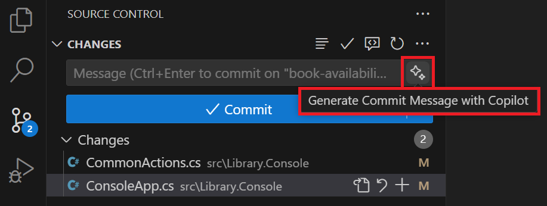

---
lab:
  title: 练习 - 使用 GitHub Copilot 开发新代码功能
  description: 了解如何在 Visual Studio Code 中使用 GitHub Copilot 加速开发新代码功能。
---

# 使用 GitHub Copilot 开发新代码功能

GitHub Copilot 的代码补全和交互式对话助手功能可帮助开发人员更快地编写代码，并减少错误。 它根据所编写代码的上下文为代码片段、函数甚至整个类提供建议。 在本练习中，你将使用 GitHub Copilot 在 Visual Studio Code 中加快新代码功能的开发。

完成此练习大约需要 30 分钟****。

> **重要说明**：若要完成本练习，必须提供自己的 GitHub 帐户和 GitHub Copilot 订阅。 如果没有 GitHub 帐户，可以<a href="https://github.com/" target="_blank">注册</a>免费的个人帐户，并使用 GitHub Copilot 免费版计划来完成练习。 如果可以从实验室环境中访问 GitHub Copilot Pro、GitHub Copilot Pro+、GitHub Copilot Business 或 GitHub Copilot Enterprise 订阅，则可以使用你现有的 GitHub Copilot 订阅来完成本练习。

## 开始之前

实验室环境必须具备以下条件：Git 2.48 或更高版本、.NET SDK 9.0 或更高版本、带有 C# Dev Kit 扩展的 Visual Studio Code，以及启用了 GitHub Copilot 的 GitHub 帐户的访问权限。

如果你将本地电脑用作本练习的实验室环境：

- 有关将本地电脑配置为实验室环境的帮助，请在浏览器中打开以下链接：<a href="https://go.microsoft.com/fwlink/?linkid=2320147" target="_blank">配置实验室环境资源</a>。

- 有关在 Visual Studio Code 中启用 GitHub Copilot 订阅的帮助，请在浏览器中打开以下链接：<a href="https://go.microsoft.com/fwlink/?linkid=2320158" target="_blank">在 Visual Studio Code 中启用 GitHub Copilot</a>。

如果你将在本练习中使用托管实验室环境：

- 有关在 Visual Studio Code 中启用 GitHub Copilot 订阅的帮助，请将以下 URL 粘贴到浏览器的网站导航栏中：<a href="https://go.microsoft.com/fwlink/?linkid=2320158" target="_blank">在 Visual Studio Code 中启用 GitHub Copilot</a>。

- 打开命令终端，并运行以下命令：

    若要确保将 Visual Studio Code 配置为使用正确的 .NET 版本，请运行以下命令：

    ```bash

    dotnet nuget add source https://api.nuget.org/v3/index.json -n nuget.org

    ```

    若要确保 Git 配置为使用姓名和电子邮件地址，请使用你的信息更新以下命令，然后运行这些命令：

    ```bash

    git config --global user.name "John Doe"

    ```

    ```bash

    git config --global user.email johndoe@example.com

    ```

## 练习场景

你是在本地社区的 IT 部门工作的开发人员。 支持公共图书馆的后端系统在一场火灾中被烧毁。 你的团队需要开发一个临时解决方案，以帮助图书馆员工管理他们的运营，直到系统可以被替换为止。 你的团队已选择使用 GitHub Copilot 来加速开发流程。

你的图书馆应用程序的初始版本已经由最终用户测试，并且要求添加一些附加功能。 你的团队同意开发以下功能：

- 书籍可借状态：可让图书管理员确定书籍的可借状态。 此功能应显示一条消息，指出某书籍可供借阅，如果该书籍当前已借给其他借阅者，该消息会显示归还截止日期。

- 书籍借阅记录：可让图书管理员将书籍借给借阅者（如果该书籍可供借阅）。 此功能应显示借阅者接收借阅书籍的选项、使用新的借阅记录更新 Loans.json，并显示借阅者的已更新借阅详细信息。

- 书籍预留：可让图书管理员为借阅者预留书籍（除非该书籍已预留）。 此功能应实现新的书籍预留过程。 此功能可能需要创建新的 Reservations.json 文件，以及支持预留过程所需的新类和接口。

每个团队成员将负责开发其中的一项新功能，然后重新组合。 你将负责开发用于确定书籍可借状态的功能。 你的同事负责开发向借阅者借书的功能。 最后一项功能（为借阅者预留书籍）将在上述两项功能完成后进行开发。

本练习包括以下任务：

1. 在 Visual Studio Code 中设置图书馆应用程序。

1. 使用 Visual Studio Code 为图书馆应用程序创建一个 GitHub 存储库。

1. 在代码存储库中创建“书籍可借状态”分支。

1. 开发新的“书籍可借状态”功能。

    - 使用 GitHub Copilot 建议来帮助更快、更准确地实现代码。
    - 将代码更新同步到远程存储库的“书籍可借状态”分支。

1. 将“书籍可借状态”更新合并到存储库的主分支中。

## 在 Visual Studio Code 中设置图书馆应用程序

需要下载现有应用程序、提取代码文件，然后在 Visual Studio Code 中打开解决方案。

使用以下步骤设置图书馆应用程序：

1. 在实验室环境中打开浏览器窗口。

1. 若要下载包含图书馆应用程序的 zip 文件，请将以下 URL 粘贴到浏览器的地址栏中：[GitHub Copilot 实验室 - 开发代码功能](https://github.com/MicrosoftLearning/mslearn-github-copilot-dev/raw/refs/heads/main/DownloadableCodeProjects/Downloads/AZ2007LabAppM3.zip)

    zip 文件命名为 AZ2007LabAppM3.zip****。

1. 从 AZ2007LabAppM3.zip 文件中解压缩文件****。

    例如：

    1. 导航到实验室环境中的下载文件夹。

    1. 右键单击 AZ2007LabAppM3.zip，然后选择“全部解压缩”********。

    1. 选择“完成时显示解压缩的文件”，然后选择“解压缩”。

1. 打开提取的文件文件夹，然后将 AccelerateDevGHCopilot 文件夹复制到易于访问的位置，例如 Windows 桌面文件夹****。

1. 在 Visual Studio Code 中打开 AccelerateDevGHCopilot 文件夹****。

    例如：

    1. 在实验室环境中打开 Visual Studio Code。

    1. 在 Visual Studio Code 中的“文件”菜单上，选择“打开文件夹” 。

    1. 导航到 Windows 桌面文件夹，选择“AccelerateDevGHCopilot”，然后选择“选择文件夹”********。

1. 在 Visual Studio Code“解决方案资源管理器”视图中，验证以下解决方案结构：

    - AccelerateDevGHCopilot\
        - src\
            - Library.ApplicationCore\
            - Library.Console\
            - Library.Infrastructure\
        - tests\
            - UnitTests\

1. 确保解决方案成功生成。

    例如，在“解决方案资源管理器”视图中，右键单击“AccelerateDevGHCopilot”，然后选择“生成”********。

    你会看到一些警告，但不应该有任何错误。

## 为代码创建 GitHub 存储库

为代码创建 GitHub 存储库，可以方便你与他人分享工作成果并协作处理项目。

> 注意****：使用自己的 GitHub 帐户为图书馆应用程序创建一个专用 GitHub 存储库。

请使用以下步骤完成本练习的这一部分：

1. 打开浏览器窗口并导航到 GitHub 帐户。

    GitHub 登录页面为：[https://github.com/login](https://github.com/login)。

1. 登录到 GitHub 帐户。

1. 打开 GitHub 帐户菜单，然后选择“你的存储库”****。

1. 切换到“Visual Studio Code”窗口。

1. 在 Visual Studio Code 中，打开“源代码管理”视图。

1. 选择“发布到 GitHub”****。

1. 存储库 AccelerateDevGHCopilot 的名称****。

    > 注意****：如果未在 Visual Studio Code 中登录到 GitHub，系统会提示你登录。 登录后，使用请求的权限授权 Visual Studio Code。

1. 选择“发布到 GitHub 专用存储库”****。

1. 请注意，Visual Studio Code 会在发布过程中显示状态消息。

    发布过程完成后，你将看到一条消息，告知你代码已成功发布到指定的 GitHub 存储库。

1. 切换到 GitHub 帐户的浏览器窗口。

1. 在 GitHub 帐户中打开新的 AccelerateDevGHCopilot 存储库。

    如果未看到 AccelerateDevGHCopilot 存储库，请刷新页面。 如果仍然看不到存储库，请尝试以下步骤：

    1. 切换到“Visual Studio Code”。
    1. 打开通知（发布新存储库时会生成一个通知）。
    1. 选择“在 GitHub 上打开”以打开存储库****。

## 在存储库中创建新分支

在开始开发新的“书籍可借状态”功能之前，需要在存储库中创建新分支。 这样便可以开发新功能且不会影响存储库的 main 分支。 代码准备就绪后，可以将新功能合并到主分支中。

请使用以下步骤完成本练习的这一部分：

1. 确保已在 Visual Studio Code 中打开 AccelerateDevGHCopilot 解决方案。

1. 选择“源代码管理”视图，并确保本地存储库已与远程存储库同步（“拉取”或“同步”）。

1. 在窗口左下角，选择“main”****。

1. 若要创建新分支，请键入“**书籍可借状态**”，然后选择“**+ 创建新分支**”。

1. 若要将新分支推送到远程存储库，请选择“发布分支”****。

## 开发新的“书籍可借状态”功能

在本练习的本部分中，你将使用 GitHub Copilot 来为图书馆应用程序开发一项新功能。 请求的功能将使图书馆管理员能够检查书籍是否可供借阅，这是当前的图书馆应用程序当前不支持的常见场景。

若要实现书籍可借状态功能，需要完成以下更新：

- 将新的 SearchBooks 操作添加到 CommonActions.cs 中的 CommonActions 枚举********。

- 更新 ConsoleApp.cs 中的 WriteInputOptions 方法****。

    - 添加对新 CommonActions.SearchBooks 选项的支持****。
    - 显示用于检查书籍是否可供借阅的选项。

- 更新 ConsoleApp.cs 中的 ReadInputOptions 方法****。

    - 添加对新 CommonActions.SearchBooks 选项的支持****。

- 更新 ConsoleApp.cs 中的 PatronDetails 方法****。

    - 在调用 ReadInputOptions 之前，将 CommonActions.SearchBooks 添加到选项************。
    - 添加 else if 来处理 SearchBooks 操作********。
    - else if 块应调用名为 SearchBooks 的新方法********。

- 在 ConsoleApp.cs 中创建一个新的 SearchBooks 方法****。

    - SearchBooks 方法应读取用户提供的书名****。
    - 检查书籍是否可供借阅，并显示一条消息，说明以下两种情况之一：

        - “book.title 可供借阅”，或者****
        - “book.title 已借给其他借阅者****。 归还截止日期为 loan.DueDate****。”

GitHub Copilot 对话助手可帮助实现完成新功能所需的代码更新。

- 可以使用内联聊天会话根据要求实现更小、更谨慎的代码更新。
- 可以使用聊天视图处理可能需要更多对话和迭代方法的较大型代码更新。

### 使用内联聊天实现“书籍可借状态”更新

通过内联聊天会话，可以直接在代码编辑器中与 GitHub Copilot 交互。 可以使用内联聊天提问、请求代码建议，以及获取 GitHub Copilot 生成的代码的说明。

请使用以下步骤完成本练习的这一部分：

1. 打开“解决方案资源管理器”视图。

1. 展开 Library.Console 项目****。

1. 打开 CommonActions.cs 文件，然后选择 **CommonActions** 枚举。

    需要向 CommonActions 添加新的 SearchBooks 操作********。

1. 打开内联聊天，然后输入以下提示：

    ```plaintext
    Update selection to include a new `SearchBooks` action.
    ```

    GitHub Copilot 应该建议进行代码更新，以将新的 SearchBooks 操作添加到 CommonActions 枚举********。

1. 查看建议的更新，然后选择“接受”****。

    更新后的代码应类似于以下代码片段：

    ```csharp

    public enum CommonActions
    {
        Repeat = 0,
        Select = 1,
        Quit = 2,
        SearchPatrons = 4,
        RenewPatronMembership = 8,
        ReturnLoanedBook = 16,
        ExtendLoanedBook = 32,
        SearchBooks = 64
    }

    ```

1. 打开 ConsoleApp.cs 文件。

1. 找到并选择 **WriteInputOptions** 方法。

    需要添加对新 CommonActions.SearchBooks 选项的支持****。 如果标记了 SearchBooks 选项，则显示用于检查书籍是否可供借阅的选项****。

1. 打开内联聊天，然后输入以下提示：

    ```plaintext
    Update selection to include an option for the `CommonActions.SearchBooks` action. Use the letter "b" and the message "to check for book availability".
    ```

    GitHub Copilot 应建议进行代码更新，为 SearchBooks 操作添加新的 if 块********。

1. 查看建议的更新，然后选择“接受”****。

    建议的更新应类似于以下代码片段：

    ```csharp

    static void WriteInputOptions(CommonActions options)
    {
        Console.WriteLine("Input Options:");
        if (options.HasFlag(CommonActions.ReturnLoanedBook))
        {
            Console.WriteLine(" - \"r\" to mark as returned");
        }
        if (options.HasFlag(CommonActions.ExtendLoanedBook))
        {
            Console.WriteLine(" - \"e\" to extend the book loan");
        }
        if (options.HasFlag(CommonActions.RenewPatronMembership))
        {
            Console.WriteLine(" - \"m\" to extend patron's membership");
        }
        if (options.HasFlag(CommonActions.SearchPatrons))
        {
            Console.WriteLine(" - \"s\" for new search");
        }
        if (options.HasFlag(CommonActions.SearchBooks))
        {
            Console.WriteLine(" - \"b\" to check for book availability");
        }
        if (options.HasFlag(CommonActions.Quit))
        {
            Console.WriteLine(" - \"q\" to quit");
        }
        if (options.HasFlag(CommonActions.Select))
        {
            Console.WriteLine("Or type a number to select a list item.");
        }
    }

    ```

1. 稍微向上滚动，找到并选择 ReadInputOptions 方法****。

    同样，需要添加对新 CommonActions.SearchBooks 选项的支持****。 包括一个案例，以处理用户对 SearchBooks 操作的选择****。

1. 打开内联聊天，然后输入以下提示：

    ```plaintext
    Update selection to include an option for the `CommonActions.SearchBooks` action.
    ```

    GitHub Copilot 应该会建议一个更新，添加一个新的案例来处理用户对 SearchBooks 操作的选择********。

1. 查看建议的更新，然后选择“接受”****。

    建议的更新应类似于以下代码片段：

    ```csharp

    static CommonActions ReadInputOptions(CommonActions options, out int optionNumber)
    {
        CommonActions action;
        optionNumber = 0;
        do
        {
            Console.WriteLine();
            WriteInputOptions(options);
            string? userInput = Console.ReadLine();

            action = userInput switch
            {
                "q" when options.HasFlag(CommonActions.Quit) => CommonActions.Quit,
                "s" when options.HasFlag(CommonActions.SearchPatrons) => CommonActions.SearchPatrons,
                "m" when options.HasFlag(CommonActions.RenewPatronMembership) => CommonActions.RenewPatronMembership,
                "e" when options.HasFlag(CommonActions.ExtendLoanedBook) => CommonActions.ExtendLoanedBook,
                "r" when options.HasFlag(CommonActions.ReturnLoanedBook) => CommonActions.ReturnLoanedBook,
                "b" when options.HasFlag(CommonActions.SearchBooks) => CommonActions.SearchBooks,
                _ when int.TryParse(userInput, out optionNumber) => CommonActions.Select,
                _ => CommonActions.Repeat
            };

            if (action == CommonActions.Repeat)
            {
                Console.WriteLine("Invalid input. Please try again.");
            }
        } while (action == CommonActions.Repeat);
        return action;
    }

    ```

1. 向下滚动，找到并选择 **PatronDetails** 方法。

    需要完成以下两项操作：

    - 在调用 ReadInputOptions 之前，需要将 CommonActions.SearchBooks 添加到选项************。
    - 还需要添加 else if 来处理 SearchBooks 操作********。 else if 块应调用名为 SearchBooks 的新方法********。

    可以使用同一提示来满足这两个要求。

1. 打开内联聊天，然后输入以下提示：

    ```plaintext
    Update selection to add `CommonActions.SearchBooks` to `options` before calling `ReadInputOptions`. Add an `else if` block to handle the `SearchBooks` action. The `else if` block should call a new method named `SearchBooks`.
    ```

    GitHub Copilot 应建议进行代码更新，在调用 ReadInputOptions 之前将 CommonActions.SearchBooks 添加到选项中************。

1. 查看建议的更新，然后选择“接受”****。

    ```csharp

    async Task<ConsoleState> PatronDetails()
    {
        Console.WriteLine($"Name: {selectedPatronDetails.Name}");
        Console.WriteLine($"Membership Expiration: {selectedPatronDetails.MembershipEnd}");
        Console.WriteLine();
        Console.WriteLine("Book Loans:");
        int loanNumber = 1;
        foreach (Loan loan in selectedPatronDetails.Loans)
        {
            Console.WriteLine($"{loanNumber}) {loan.BookItem!.Book!.Title} - Due: {loan.DueDate} - Returned: {(loan.ReturnDate != null).ToString()}");
            loanNumber++;
        }

        CommonActions options = CommonActions.SearchPatrons | CommonActions.Quit | CommonActions.Select | CommonActions.RenewPatronMembership | CommonActions.SearchBooks;
        CommonActions action = ReadInputOptions(options, out int selectedLoanNumber);
        if (action == CommonActions.Select)
        {
            if (selectedLoanNumber >= 1 && selectedLoanNumber <= selectedPatronDetails.Loans.Count())
            {
                var selectedLoan = selectedPatronDetails.Loans.ElementAt(selectedLoanNumber - 1);
                selectedLoanDetails = selectedPatronDetails.Loans.Where(l => l.Id == selectedLoan.Id).Single();
                return ConsoleState.LoanDetails;
            }
            else
            {
                Console.WriteLine("Invalid book loan number. Please try again.");
                return ConsoleState.PatronDetails;
            }
        }
        else if (action == CommonActions.Quit)
        {
            return ConsoleState.Quit;
        }
        else if (action == CommonActions.SearchPatrons)
        {
            return ConsoleState.PatronSearch;
        }
        else if (action == CommonActions.RenewPatronMembership)
        {
            var status = await _patronService.RenewMembership(selectedPatronDetails.Id);
            Console.WriteLine(EnumHelper.GetDescription(status));
            // reloading after renewing membership
            selectedPatronDetails = (await _patronRepository.GetPatron(selectedPatronDetails.Id))!;
            return ConsoleState.PatronDetails;
        }
        else if (action == CommonActions.SearchBooks)
        {
            return await SearchBooks();
        }

        throw new InvalidOperationException("An input option is not handled.");
    }

    ```

    > 注意****：内联聊天建议的代码可能包括 SearchBooks 方法的存根代码****。 可以接受该代码。 在下一部分中，你将实现 SearchBooks 方法****。

### 使用聊天视图实现 SearchBooks 方法

实现“书籍可借状态”更新还剩一个步骤，即创建 SearchBooks 方法****。 SearchBooks 方法将读取用户提供的书名，检查此书是否可供借阅，并显示一条消息，指示此书的可借状态****。 你将使用聊天视图来评估要求并实现 SearchBooks 方法****。

GitHub Copilot 的聊天视图提供了对话和交互式环境，而使用内联聊天时无法提供该环境。 可以使用聊天视图提问、请求代码建议，以及获取 GitHub Copilot 生成的代码说明。 聊天视图支持以下三种模式：

- 要求模式：使用询问模式更好地了解代码库、集思广益和编码任务的帮助。 在询问模式下生成的代码建议可以直接实现到代码库或复制到剪贴板。
- 编辑模式：编辑模式用于更改代码，例如重构或添加新功能。 编辑模式可以跨项目中的多个文件进行编辑。
- 代理模式：代理模式用于定义高级任务，并启动代理代码编辑会话来完成该任务。 在代理模式下，Copilot 会自主规划所需的工作，并确定相关的文件和上下文。 代理可以更改代码、运行测试，甚至部署应用程序。

你将使用询问模式和编辑模式实现 SearchBooks 方法****。

请使用以下步骤完成本练习的这一部分：

1. 请花点时间思考一下 SearchBooks 方法的过程要求****。

    方法需要完成的过程是什么？ 此方法的返回类型是什么？ 它是否需要参数？

    SearchBooks 方法应实现以下过程****：

    1. 提示用户输入书籍标题。
    1. 读取用户提供的书籍标题。
    1. 检查书籍是否可供借阅。
    1. 显示一条消息，其中指明了以下选项之一：

        - “{book.title} 可供借阅****”
        - “{book.title} 已借给其他借阅者****。 归还截止日期为 {loan.DueDate}****。”

    若要生成消息选项，代码需要访问以下 JSON 文件：

    - 需要 Books.json 才能找到匹配的 Title 和 BookId************。
    - 需要 Loans.json 才能找到匹配 BookItemId 的 ReturnDate 和 DueDate****************。 BookItemId 与 Books.json 中的 BookId 相同************。

1. 确保在 ConsoleApp.cs 文件中创建了以下 **SearchBooks** 方法：

    ```csharp

    async Task<ConsoleState> SearchBooks()
    {

        return ConsoleState.PatronDetails;
    }

    ```

    > 注意****：请务必删除 GitHub Copilot 创建的所有代码注释。 不必要和不准确的注释会对 GitHub Copilot 的建议产生负面影响。

1. 选择 **SearchBooks** 方法。

1. 打开“聊天”视图，然后输入以下提示：

    ```plaintext
    Update selection to obtain a book title. Prompt the user to "Enter a book title to search for". Read the user input and ensure the book title isn't null.
    ```

1. 查看建议的时间。

    建议的更新应类似于以下代码片段：

    ```csharp

    async Task<ConsoleState> SearchBooks()
    {
        string? bookTitle = null;
        while (string.IsNullOrWhiteSpace(bookTitle))
        {
            Console.Write("Enter a book title to search for: ");
            bookTitle = Console.ReadLine();
        }
    
        // Placeholder for further logic to search for the book
        Console.WriteLine($"Searching for the book titled \"{bookTitle}\"...");
    
        return ConsoleState.PatronDetails;
    }

    ```

1. 将鼠标指针悬停在建议的代码上，然后选择“应用于 src\\Library.Console\\ConsoleApp.cs”****。

    建议的代码应显示在代码编辑器中，其中包含“保留”或“撤消”选项********。

1. 在代码编辑器中，若要接受建议的代码，请选择“保留”****。

1. 选择 **SearchBooks** 方法。

1. 使用拖放操作将以下文件添加到聊天上下文：

    （来自 Library.Console 项目）
    - ConsoleApp.cs
    - Program.cs
    - Books.json
    - Loans.json
    - BookItems.json

    （来自 Library.Infrastructure 项目）
    - JsonData.cs
    - JsonLoanRepository.cs

1. 输入以下提示：

    ```plaintext
    @workspace  Explain how to update the `SearchBooks` method and ConsoleApps class to find a matching book title in the `Books.json` file. Use the user supplied book title to find a matching book. If a book is found, use Loans.json to check if the book is available for loan. If the book has been returned, display a message stating "`book.title` is available for loan". If the book is on loan, display a message stating "`book.title` is on loan to another patron. The return due date is `loan.DueDate`".
    ```

1. 请花点时间来查看建议的更新。

    请注意以下内容：

    - 答复包含建议更新的详细说明。
    - ConsoleApp 类需要 JsonData 对象才能访问 Books.json 和 Loans.json。 建议的代码使用依赖项注入将 JsonData 对象传递给 ConsoleApp 类构造函数。
    - SearchBooks 方法必须将逻辑更新为确定书籍标题的可借状态并显示相应的消息。 建议的代码使用 LINQ 查询来检查借阅状态。
    - 必须更新 Program.cs 文件才能将 JsonData 对象传递给 ConsoleApp 类。

    答复应包含以下信息：

    ```plaintext

    1. Dependency Injection:
    
        Added JsonData as a dependency to the ConsoleApp constructor to access the JSON data files.

    2. Book Search:
    
        Used FirstOrDefault to find a book in Books.json that matches the user-supplied title (case-insensitive).

    3. Book Item Lookup:
    
        Retrieved the corresponding BookItem using the BookId from BookItems.json.

    4. Loan Check:
    
        Checked Loans.json for an active loan (i.e., a loan with a null ReturnDate) for the BookItem.

    5. Output Messages:
    
        Displayed whether the book is available for loan or currently on loan with the due date.

    Integration in Program.cs

        Ensure that JsonData is registered in the dependency injection container in Program.cs:

    ```

    可以使用聊天视图的询问模式分析代码更新，然后使用编辑模式实现代码更新********。

1. 使用 GitHub Copilot 的答复来构造新的提示。

    例如，可以使用说明部分创建以下提示：

    ```plaintext

    Add JsonData as a dependency to the ConsoleApp constructor to access the JSON data files. Use FirstOrDefault to find a book in Books.json that matches the user-supplied title (case-insensitive). Retrieve the corresponding BookItem using the BookId from BookItems.json. Check Loans.json for an active loan (loan.ReturnDate == null) for the BookItem. Display whether the book is available for loan or currently on loan with the due date. Ensure that JsonData is registered in the dependency injection container in Program.cs.

    ```

    可以调整提示以实现特定要求。 例如，如果希望向最终用户显示特定消息，可以将该要求添加到提示：

    ```plaintext

    Add JsonData as a dependency to the ConsoleApp constructor to access the JSON data files. Use FirstOrDefault to find a book in Books.json that matches the user-supplied title (case-insensitive). Retrieve the corresponding BookItem using the BookId from BookItems.json. Check Loans.json for an active loan (loan.ReturnDate == null) for the BookItem. Display whether the book is available for loan or currently on loan with the due date. Ensure that JsonData is registered in the dependency injection container in Program.cs. If the book has been returned, display a message stating "`book.title` is available for loan". If the book is on loan, display a message stating "`book.title` is on loan to another patron. The return due date is `loan.DueDate`".

    ```

1. 若要将聊天视图切换到编辑模式，请选择“设置模式”，然后选择“编辑”********。

    当系统提示开始新会话时，请选择“是”****。

1. 使用拖放操作将以下文件添加到聊天上下文：

    （来自 Library.Console 项目）
    - ConsoleApp.cs
    - Program.cs
    - Books.json
    - Loans.json
    - BookItems.json

    （来自 Library.Infrastructure 项目）
    - JsonData.cs
    - JsonLoanRepository.cs

1. 选择 **SearchBooks** 方法。

1. 输入以下提示：

    ```plaintext

    Add JsonData as a dependency to the ConsoleApp constructor to access the JSON data files. Use FirstOrDefault to find a book in Books.json that matches the user-supplied title (case-insensitive). Retrieve the corresponding BookItem using the BookId from BookItems.json. Check Loans.json for an active loan (loan.ReturnDate == null) for the BookItem. Display whether the book is available for loan or currently on loan with the due date. Ensure that JsonData is registered in the dependency injection container in Program.cs. If the book has been returned, display a message stating "`book.title` is available for loan". If the book is on loan, display a message stating "`book.title` is on loan to another patron. The return due date is `loan.DueDate`".

    ```

1. 请花点时间查看 ConsoleApp.cs 文件中建议的更新。

    可以使用“上一页”和“下一页”浏览建议的代码更新，也可以手动滚动浏览文件********。

    **ConsoleApp.cs**

    在 ConsoleApp 类顶部附近可以找到将 JsonData 依赖项添加到 ConsoleApp 构造函数的代码更新********。

    ```csharp

    JsonData _jsonData;

    public ConsoleApp(ILoanService loanService, IPatronService patronService, IPatronRepository patronRepository, ILoanRepository loanRepository, JsonData jsonData)
    {
        _patronRepository = patronRepository;
        _loanRepository = loanRepository;
        _loanService = loanService;
        _patronService = patronService;
        _jsonData = jsonData;
    }

    ```

    在 SearchBooks 方法中可以找到检查书籍是否可供借阅的代码更新****。

    ```csharp

    async Task<ConsoleState> SearchBooks()
    {
        string? bookTitle = null;
        while (string.IsNullOrWhiteSpace(bookTitle))
        {
            Console.Write("Enter a book title to search for: ");
            bookTitle = Console.ReadLine();
        }

        await _jsonData.EnsureDataLoaded();

        var book = _jsonData.Books!.FirstOrDefault(b => string.Equals(b.Title, bookTitle, StringComparison.OrdinalIgnoreCase));
        if (book == null)
        {
            Console.WriteLine($"No book found with the title \"{bookTitle}\".");
            return ConsoleState.PatronDetails;
        }

        var bookItem = _jsonData.BookItems!.FirstOrDefault(bi => bi.BookId == book.Id);
        if (bookItem == null)
        {
            Console.WriteLine($"No book item found for the title \"{book.Title}\".");
            return ConsoleState.PatronDetails;
        }

        var loan = _jsonData.Loans!.FirstOrDefault(l => l.BookItemId == bookItem.Id && l.ReturnDate == null);
        if (loan == null)
        {
            Console.WriteLine($"\"{book.Title}\" is available for loan.");
        }
        else
        {
            Console.WriteLine($"\"{book.Title}\" is on loan to another patron. The return due date is {loan.DueDate}.");
        }

        return ConsoleState.PatronDetails;
    }

    ```

    **Program.cs**

    用于注册 JsonData 和 ConsoleApp 进行依赖项注入的代码已在 Program.cs 文件中提供。

    ```csharp

    services.AddSingleton<JsonData>();
    services.AddSingleton<ConsoleApp>();

    ```

1. 在聊天视图中，若要保留所有编辑，请选择“保留”****。

    请务必查看 GitHub Copilot 建议，然后再接受更新。

    如果不确定建议的更新，可以接受更改，然后要求 GitHub Copilot 给出解释。 如果拒绝更新，则可以还原编辑。

    > 注意****：如果 GitHub Copilot 建议使用区域性特定的格式设置返回日期的格式，请确保将 `using System.Globalization;` 语句添加到 ConsoleApp.cs 文件的顶部。

1. 确保已接受 ConsoleApp.cs 和 Program.cs 文件中的更新。

1. 滚动到 ConsoleApp.cs 文件的顶部，找到以下代码行：

    ```csharp

    JsonData _jsonData;

    ```

1. 如果无法识别 ConsoleApp 类中的 JsonData，请在 ConsoleApp 类上方添加以下 using 语句。

    ```csharp
    
    using Library.Infrastructure.Data;
    
    ```

1. 打开 Visual Studio Code 的“解决方案资源管理器”视图。

1. 生成解决方案并确保代码更新未引入任何错误。

    你将看到警告消息，但不应出现任何错误。

    若要在“解决方案资源管理器”视图中生成解决方案，请右键单击“AccelerateDevGHCopilot”，然后选择“生成”********。

## 将“书籍可借状态”更新合并到存储库的主分支中

在将代码合并到存储库的主分支之前，请务必测试该代码。 测试可确保代码按预期工作，且不会引入任何新问题。 在本练习中，你将使用手动测试来验证“书籍可借状态”功能是否按预期工作。

在本练习的本部分，你需要完成以下任务：

1. 测试“书籍可借状态”功能。
1. 将更改与远程存储库同步。
1. 创建一个拉取请求，以将更改合并到存储库的 main 分支中。

### 测试“书籍可借状态”功能

手动测试可用于验证新功能是否按预期工作。 必须使用可验证的数据源。 在这种情况下，使用 Books.json 和 Loans.json 文件来验证新功能是否正确报告书籍的可借状态********。

请使用以下步骤完成本练习的这一部分：

1. 若要运行该应用程序，请右键单击“Library.Console”，选择“调试”，然后选择“启动新实例”************。

1. 当系统提示你输入借阅者姓名时，请键入 1，然后按 Enter****。

    你应会看到与搜索查询匹配的借阅者列表。

1. 在“输入选项”提示处键入 2，然后按 Enter****。

    输入 2 会选择列表中的第二位借阅者****。

    你应会看到借阅者的姓名和会员状态，以及书籍的借阅详细信息。

1. 在“输入选项”提示处键入 b，然后按 Enter****。

    输入 b 会选择用于搜索书籍可借状态的选项****。

    你应会看到用于输入书籍标题的提示。

1. 键入“书籍 1”，然后按 Enter****。

    在下载的原始数据中，“书籍 1”当前已借给“借阅者 49”，因此不可借阅********。

1. 验证应用程序是否显示了一条消息，指出该书籍已借给另一位借阅者。

1. 在“输入选项”提示处键入 b，然后按 Enter****。

1. 键入“Book Nineteen”，然后按 Enter 键****。

1. 验证应用程序是否显示了一条消息，指出该书籍可供借阅。

1. 在“输入选项”提示处键入 q，然后按 Enter****。

1. 停止调试会话。

1. 使用“资源管理器”视图查找并打开 Loans.json 文件****。

    Loans.json 文件用于跟踪每本书籍的借阅状态。 可以使用 Loans.json 文件来验证书籍 1 和书籍 19 的可借状态是否正确。

    更新后的 Loans.json 文件应位于 Library.Console\bin\Debug\net8.0\Json 文件夹或 Library.Console\Json 文件夹中********。

    - 如果使用 Visual Studio Code 调试程序运行应用，则更新后的 Loans.json 文件应位于 Library.Console\bin\Debug\net8.0\Json 文件夹中****。

    - 如果使用 AccelerateDevGHCopilot\src\Library.Console 文件夹中的 dotnet run 命令来运行应用，则更新后的 Loans.json 文件应位于 Library.Console\Json 文件夹中************。

1. 验证借阅 ID 37 和借阅 ID 46 是否均适用于书籍 1 ("BookItemId":**** 1)。

    借阅 ID 在 Loans.json 文件中按顺序列出。

    - 借阅 ID 37 的 ReturnDate 值应为“2024-01-17”，指示书籍已在该日期退还********。
    - 借阅 ID 46 的 ReturnDate 值应为“null”，表示该书当前处于借阅状态（2024-07-09 借阅，但未退还）************。

    ReturnDate 值用于确定该书籍当前是否已借出****。 如果 ReturnDate 值为“null”，则该书当前已借出********。

1. 验证借阅 ID 34 是否适用于书籍 19 ("BookItemId":**** 19)，并且 ReturnDate 是否已分配有值****。

### 将更改与远程存储库同步

1. 选择“源代码管理”视图。

1. 确保更新的文件列在“更改”下****。

    应该会看到在“更改”下列出了 CommonActions.cs 和 ConsoleApp.cs 文件****。 还可能列出 Program.cs 文件。

1. 使用 GitHub Copilot 为“提交”生成消息****。

    

1. 若要暂存并提交更改，请选择“提交”，然后选择“是”********。

1. 若要将更改同步到远程存储库，请选择“同步更改”****。

### 创建拉取请求以将更改合并到 main 分支

你已实现帮助图书管理员确定书籍可借状态的功能。 现在需要将更改合并到存储库的 main 分支中。 可以创建一个拉取请求，以将更改合并到 main 分支中。

请使用以下步骤完成本练习的这一部分：

1. 在 Web 浏览器中打开 GitHub 存储库。

    若要从 Visual Studio Code 打开 GitHub 存储库，请执行以下操作：

    1. 在 Visual Studio Code 窗口左下角，选择“book-availability”****。
    1. 在上下文菜单中，在 book-availability 分支右侧，选择“在 GitHub 中打开”图标********。

1. 在 GitHub 存储库页上，选择“比较和拉取请求”选项卡****。

1. 确保在“基”中指定“主”，在“比较”中指定“book-availability”，并选中“能够合并”********************。

1. 在“添加说明”下，选择“Copilot Actions”按钮（GitHub Copilot 图标），然后选择生成摘要选项****。

    > 注意****：GitHub Copilot 免费版计划目前不支持拉取请求摘要功能。

    如果使用 GitHub Copilot 免费版计划，则可以编写自己的摘要，或使用下面的摘要来完成拉取请求。

    ```plaintext

    This pull request introduces a new feature to the library console application: the ability to search for books and check their availability. It also includes updates to dependency injection and the CommonActions enumeration to support this functionality. Below are the most important changes grouped by theme.

    New Feature: Book Search

    Added a new SearchBooks action to the CommonActions enumeration (src/Library.Console/CommonActions.cs).

    Updated PatronDetails method to handle the SearchBooks action, including a new SearchBooks method that allows users to search for a book by title and check its availability (src/Library.Console/ConsoleApp.cs).

    Modified ReadInputOptions and WriteInputOptions methods to include the new SearchBooks option (src/Library.Console/ConsoleApp.cs).

    Dependency Injection Updates

    Added JsonData as a dependency in the ConsoleApp constructor and ensured it is registered in the DI container before ConsoleApp (src/Library.Console/ConsoleApp.cs, src/Library.Console/Program.cs).

    ```

1. 生成摘要后，选择“预览”****。

1. 请花点时间查看摘要。

    GitHub Copilot 生成的拉取请求摘要应类似于以下示例：

    

1. 选择“创建拉取请求”****。

1. 如果所有检查都通过并且与基分支没有冲突，请选择“合并拉取请求”，然后选择“确认合并”********。

    请注意，合并更改后可以删除 book-availability 分支****。 若要删除分支，请选择“删除分支”****。

1. 切换回“Visual Studio Code”窗口。

1. 切换到存储库的 main 分支****。

1. 打开“源代码管理”视图，然后从远程存储库拉取更改****。

1. 验证 book-availability 功能是否在主分支中可用****。

## 总结

在本练习中，你学习了如何使用 GitHub Copilot 为 C# 应用程序开发新的代码功能。 你使用 GitHub Copilot 的内联聊天和聊天视图在新分支中开发了功能，测试了代码，然后将更改合并到存储库的主分支中。 还使用了 GitHub Copilot 生成提交消息和拉取请求摘要。

## 清理

现在，你已经完成了本练习，请花点时间确保你没有对 GitHub 帐户或 GitHub Copilot 订阅做出任何你不希望保留的更改。 如果你进行了任何更改，请立即还原。
