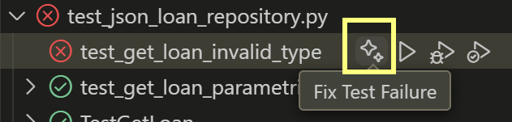

---
lab:
  title: 练习 - 使用 GitHub Copilot 开发单元测试 (Python)
  description: 了解如何在 Visual Studio Code 中使用 GitHub 加速单元测试的开发。
---

# 使用 GitHub Copilot 开发单元测试

GitHub Copilot 背后的大型语言模型是基于各种代码测试框架和方案训练的。 GitHub Copilot 是生成测试用例、测试方法、测试断言和 mock 以及测试数据的绝佳工具。 在本练习中，你将使用 GitHub Copilot 加速开发 Python 应用程序的单元测试。

完成本练习大约需要 25 分钟****。

> **重要说明**：若要完成本练习，必须提供自己的 GitHub 帐户和 GitHub Copilot 订阅。 如果没有 GitHub 帐户，可以<a href="https://go.microsoft.com/fwlink/?linkid=2320148" target="_blank">注册</a>免费的个人帐户，并使用 GitHub Copilot 免费版计划来完成练习。 如果可以从实验室环境中访问 GitHub Copilot Pro、GitHub Copilot Pro+、GitHub Copilot Business 或 GitHub Copilot Enterprise 订阅，则可以使用你现有的 GitHub Copilot 订阅来完成本练习。

## 开始之前

实验室环境必须包括以下内容：Git 2.48 或更高版本、Python 3.10 或更高版本、带有 Microsoft Python 扩展的 Visual Studio Code，以及启用了 GitHub Copilot 的 GitHub 帐户的访问权限。

如果你将本地电脑用作本练习的实验室环境：

- 有关将本地电脑配置为实验室环境的帮助，请在浏览器中打开以下链接：<a href="https://microsoftlearning.github.io/mslearn-github-copilot-dev/Instructions/Labs/LAB_AK_00_configure_lab_environment_py.html" target="_blank">配置实验室环境资源</a>。

- 有关在 Visual Studio Code 中启用 GitHub Copilot 订阅的帮助，请在浏览器中打开以下链接：<a href="https://go.microsoft.com/fwlink/?linkid=2320158" target="_blank">在 Visual Studio Code 中启用 GitHub Copilot</a>。

如果你将在本练习中使用托管实验室环境：

- 有关在 Visual Studio Code 中启用 GitHub Copilot 订阅的帮助，请将以下 URL 粘贴到浏览器的网站导航栏中：<a href="https://go.microsoft.com/fwlink/?linkid=2320158" target="_blank">在 Visual Studio Code 中启用 GitHub Copilot</a>。

- 打开命令终端，并运行以下命令：

    若要确保将 Visual Studio Code 配置为使用正确的 Python 版本，请验证 Python 安装是否为 3.10 或更高版本：

    ```bash
    python --version
    ```

    若要确保 Git 配置为使用你的姓名和电子邮件地址，请使用你的信息更新以下命令，然后运行这些命令：

    ```bash

    git config --global user.name "John Doe"

    ```

    ```bash

    git config --global user.email johndoe@example.com

    ```

## 练习场景

你是一名在当地社区 IT 部门工作的开发人员。 支持公共图书馆的后端系统在一场火灾中被烧毁。 你的团队需要开发一个临时项目，以帮助图书馆员工管理他们的运营，直到系统可以被替换为止。 你的团队已选择使用 GitHub Copilot 来加速开发流程。

你有一个图书馆应用程序的初始版本，其中包括一个名为 UnitTests 的单元测试项目。 你需要使用 GitHub Copilot 加速开发其他单元测试。

本练习包括以下任务：

1. 在 Visual Studio Code 中设置图书馆应用程序。

1. 检查 UnitTests 项目实现的单元测试方法。

1. 扩展 UnitTests 项目以开始测试 library\infrastructure 项目中的数据访问类。

## 在 Visual Studio Code 中设置图书馆应用程序

你需要下载现有的应用程序、提取代码文件，然后在 Visual Studio Code 中打开项目。

使用以下步骤设置图书馆应用程序：

1. 在实验室环境中打开浏览器窗口。

1. 若要下载包含图书馆应用程序的 zip 文件，请将以下 URL 粘贴到浏览器的地址栏中：[GitHub Copilot 实验室 - 开发单元测试](https://github.com/MicrosoftLearning/mslearn-github-copilot-dev/raw/refs/heads/main/DownloadableCodeProjects/Downloads/AZ2007LabAppM4Python.zip)

    zip 文件名为 AZ2007LabAppM4Python.zip。****

1. 从 AZ2007LabAppM4Python.zip 文件中提取文件。****

    例如：

    1. 导航到实验室环境中的下载文件夹。

    1. 右键单击“AZ2007LabAppM4Python.zip”，然后选择“全部解压缩”********。

    1. 选择“完成时显示解压缩的文件”，然后选择“解压缩”。

1. 打开解压缩的文件文件夹，然后将 AccelerateDevGHCopilot 文件夹复制到易于访问的位置，例如 Windows 桌面文件夹。****

1. 在 Visual Studio Code 中打开 AccelerateDevGHCopilot 文件夹。****

    例如：

    1. 在实验室环境中打开 Visual Studio Code。

    1. 在 Visual Studio Code 中的“文件”菜单上，选择“打开文件夹” 。

    1. 导航到 Windows 桌面文件夹，选择“AccelerateDevGHCopilot”，然后选择“选择文件夹”********。

1. 在 Visual Studio Code 的“资源管理器”视图中，验证以下项目结构：

    - AccelerateDevGHCopilot/library   ├── application_core   ├── console   ├── infrastructure   └── tests

## 检查测试目录实现的单元测试方法

在练习的本节中，使用 GitHub Copilot 检查 UnitTests 项目实现的单元测试方法。

请使用以下步骤完成本练习的这一部分：

1. 在“资源管理器”视图中，展开“tests”文件夹。****

    现有代码库包括实现以下文件夹结构的 UnitTests 项目：

    ─ tests   ├─ test_patron_service.py

    测试项目结构反映并支持 application_core 项目的 2 个 services 部分。********

   ─ application_core  └─ services     ├─ loan_service.py     ├─ patron_service.py

1. 打开“聊天”视图。

1. 将以下文件添加到聊天上下文：

    （在 library\application_core\services\ 下）

    - loan_service.py
    - patron_service.py

    （在 library\tests\ 下）

    - test_patron_service.py
    - test_loan_service.py

1. 若要了解现有单元测试项目，请输入以下提示：

    ```plaintext
    @workspace Explain the approach to unit testing that's been implemented in this workspace.
    ```

    此提示要求 GitHub Copilot 说明工作区上下文中的单元测试方法。 将相关文件添加到聊天上下文可改进回复。

1. 请花点时间查看 GitHub Copilot 的回复。

    > 你应该会看到类似于以下示例的描述：
    >
    > 此工作区使用标准 Python 单元测试方法，采用 `unittest` 框架并通过 `unittest.mock.MagicMock` 进行模拟。 主要功能如下：
    >
    > - **测试类**：每个服务（例如 `LoanService`、`PatronService`）都有相应的测试类（例如 `TestLoanService`、`PatronServiceTest`）。
    > - **设置**：`setUp` 方法创建一个模拟仓库，并将其注入到正在测试的服务中，将业务逻辑与数据访问隔离开来。
    > - **测试方法**：每个方法都会测试特定行为，例如成功续订成员身份或处理缺失的数据。
    > - **断言**：测试使用断言（例如 `self.assertEqual`）来验证预期结果。
    > - **测试数据**：测试对象（例如 `Patron`、`Loan`）是使用每个方案的相关属性创建的。
    > - **测试发现**：每个测试文件包括：
    >
    >     ```python
    >     if __name__ == "__main__":
    >         unittest.main()
    >     ```
    >
    > - **模拟**：模拟仓库方法来控制返回值并隔离逻辑。
    >
    > 请参阅 `library2/tests/test_patron_service.py` 和 `library2/tests/test_loan_service.py` 中的示例。

1. 若要分析当前方法的优点，请输入以下提示：

    ```plaintext
    @workspace What are the benefits of this approach to unit testing?
    ```

1. 请花点时间查看 GitHub Copilot 的回复。

    你可以继续对话，并询问有关单元测试方法特定方面的详细信息。 例如，可以询问使用测试工厂、模拟依赖项或测试整体结构的好处。

1. 请花点时间考虑如何扩展现有方法来测试 library\infrastructure 项目。

    library\infrastructure 项目包含与文件系统交互以加载和保存数据的数据访问类。

1. 将以下文件添加到聊天上下文：

    - library\application_core\services\loan_service.py
    - library\application_core\services\patron_service.py

    - library\application_core\enums\loan_extension_status.py
    - library\application_core\enums\loan_return_status.py
    - library\application_core\enums\membership_renewal_status.py

    - library\tests\test_patron_service.py
    - library\tests\test_loan_service.py

1. 若要请求 GitHub Copilot 帮助扩展 UnitTests 项目，请输入以下提示：

    ```plaintext
    @workspace How can I extend the `tests` project to begin testing methods in the `library\infrastructure` project? 
    Provide a process overview.
    ```

    此提示将请求 GitHub Copilot 提供扩展 UnitTests 项目以开始测试 library\infrastructure 项目中的方法的过程概述。 提示中包含多个文件，以提供响应的上下文。

1. 花点时间查看 GitHub Copilot 的响应。

    >你应该会看到类似于以下示例的说明：
    >
    >若要扩展 `tests` 项目以涵盖 `library4Test/infrastructure` 项目中的方法，请遵循此过程：
    >
    >1. **标识目标方法**：  
    >   查看 `infrastructure/`（例如 `json_data.py`、`json_loan_repository.py`、`json_patron_repository.py`）中的代码并选择要测试的方法。
    >
    >2. **创建新测试文件**  
    >   在 `tests/` 目录中，按照用于现有测试的命名约定创建新的测试文件，例如 `test_json_data.py`、`test_json_loan_repository.py` 等。
    >
    >3. **导入类/函数**  
    >   在每个新的测试文件中，从 `infrastructure` 模块导入相关类或函数。
    >
    >4. **编写测试类和方法**  
    >   - 使用 `unittest.TestCase` 作为基类。
    >   - 如果需要初始化对象或测试数据，则实现 `setUp`。
    >   - 为要验证的每个行为或边缘案例编写测试方法。
    >
    >5. **模拟外部依赖项**  
    >   如果基础结构代码与文件或外部系统交互，则使用 `unittest.mock` 来模拟这些依赖项，确保测试是隔离且可重复的。
    >
    >6. **使用断言**  
    >   使用断言（`self.assertEqual`、`self.assertTrue` 等）来检查方法是否按预期方式行为。
    >
    >7. **运行和优化测试**  
    >   使用命令行或 IDE 的测试运行程序运行测试。 根据结果按需优化测试和代码。
    >
    >**示例架构：**
    >
    >```python
    >import unittest
    >from infrastructure.json_data import JsonData  # Adjust import as needed
    >
    >class TestJsonData(unittest.TestCase):
    >    def test_some_method(self):
    >        # Arrange
    >        # Act
    >        # Assert
    >        pass
    >
    >if __name__ == "__main__":
    >    unittest.main()
    >```
    >
    >**汇总：**  
    >
    >- 在 `tests/` 中为每个基础结构模块添加新的测试文件。
    >- 使用 `unittest` 导入和测试方法。
    >- 按需模拟外部依赖项。
    >- 使用断言来验证行为。
    >&nbsp;

你的结果可能会略有不同，请仔细检查。

    > **TIP**: Use GitHub Copilot's **Ask** mode to investigate your approach to testing. Use the responses to plan, develop, or extend your unit tests.

## 扩展 UnitTests 项目以开始测试数据访问类

library\infrastructure 文件包含与文件系统交互以加载和保存数据的数据访问类。**** 该项目包括以下类：

- JsonData (`json_data.py`)：加载和保存 JSON 数据的类。
- JsonLoanRepository (`json_loan_repository.py`)：实现 ILoanRepository 接口并使用 JsonData 类加载和保存贷款数据的类。
- JsonPatronRepository (`json_patron_repository.py`)：实现 IPatronRepository 接口并使用 JsonData 类加载和保存顾客数据的类。

### 使用智能体模式创建新的测试类

当你有一个特定任务并希望使 Copilot 能够自主编辑代码时，可以使用聊天视图的智能体模式。 例如，可以使用智能体模式创建和编辑文件，或调用工具来完成任务。 在智能体模式下，GitHub Copilot 可以自主规划所需的工作并确定相关的文件和上下文。 然后，它会对代码库进行编辑，并调用工具来完成你发出的请求。

> 注意****：智能体模式仅在 Visual Studio Code 中可用。 如果是在其他环境中使用 GitHub Copilot，则可以使用聊天模式完成类似的任务。

在本练习的本节中，你将使用 GitHub Copilot 的智能体模式为 JsonLoanRepository 类的 GetLoan 方法创建新的测试类。

请使用以下步骤完成本练习的这一部分：

1. 在“聊天”视图中，选择“设置模式”按钮，然后选择“智能体”。********

    > **重要说明**：在智能体模式下使用“聊天”视图时，GitHub Copilot 可能会发出多个高级请求来完成单个任务。 高级请求可由用户发起的提示和 Copilot 代表你采取的后续操作使用。 使用的高级请求总数取决于任务的复杂性、所涉及的步骤数和所选的模型。

1. 若要启动为 JsonLoanRepository.get_loan 方法 (infrastructure\json_loan_repository.py) 创建测试类的自动化任务，请输入以下提示：

    ```plaintext

    Add a `test_json_loan_repository.py` file to the **library\tests** directory. Create a class named `TestJsonLoanRepository`. 
    In the `TestJsonLoneRepository` class create a stub class named `get_loan`. Add a reference to classes tested.

    ```

    此提示要求 GitHub Copilot 在测试项目文件夹中创建新的类文件。

    - tests\
      - test_json_loan_repository.py

    提示还要求 GitHub Copilot 添加对 library\infrastructure 的引用。****

1. 花点时间查看 GitHub Copilot 的响应。

    请注意“聊天”视图和代码编辑器中的以下更新：

    - 智能体会在完成请求的任务时显示状态消息。 第一个任务是创建 test_json_loan_repository.py 文件。**** 智能体可能会在创建文件之前暂停并要求你进行确认。

        

    - test_json_loan_repository.py 文件会在代码编辑器中打开，其中包含与以下更新类似的编辑：****

        ```python

        import unittest
        from infrastructure.json_loan_repository import JsonLoanRepository
        from infrastructure.json_data import JsonData
        from application_core.entities.loan import Loan
        
        class TestJsonLoanRepository(unittest.TestCase):
            def get_loan(self):
                # Stub for get_loan test
                pass
        
        if __name__ == "__main__":
            unittest.main()

        ```

1. 如果智能体暂停任务并请求你授予在终端中运行 make 目录命令的权限，请选择“保留”或“继续”。********

    选择“保留”或“继续”时，GitHub Copilot 将完成以下操作：********

    - tests 文件夹中会创建一个名为 test_json_loan_repository.py 的新文件。********

1. 花点时间来查看更新。

    你应该会在编辑器中看到以下更新：

    - tests 文件夹现在包含 test_json_loan_repository.py，其中引用了 infrastructure.json_loan_repository。************

1. 在“聊天”视图中，若要接受所有更改，请选择“保留”。****

1. 在“资源管理器”视图中，展开 library\tests 文件夹。****

    应该看到以下文件夹结构：

    tests    ├─ test_json_loan_repository.py    ├─ test_loan_service.py    └─ test_patron_service.py

### 准备为 GetLoan 方法创建单元测试

在本练习的本节中，你将使用 GitHub Copilot 的编辑模式为 JsonLoanRepository 类 (json_loan_repository.py) 中的 GetLoan 方法创建单元测试。************

请使用以下步骤完成本练习的这一部分：

1. 在“聊天”视图中，选择“设置模式”按钮，然后选择“编辑”。********

    使用“编辑”模式更新所选文件。 回复会以代码建议的形式显示在代码编辑器中。

1. 从 library\infrastructure 文件夹中打开 json_loan_repository.py 文件。********

1. 花点时间查看 json_loan_repository.py 文件。****

    ```python
    import json
    from datetime import datetime
    from application_core.interfaces.iloan_repository import ILoanRepository
    from application_core.entities.loan import Loan
    from .json_data import JsonData
    from typing import Optional
    
    class JsonLoanRepository(ILoanRepository):
        def __init__(self, json_data: JsonData):
            self._json_data = json_data
    
        def get_loan(self, loan_id: int) -> Optional[Loan]:
            for loan in self._json_data.loans:
                if loan.id == loan_id:
                    return loan
            return None
    
        def update_loan(self, loan: Loan) -> None:
            for idx in range(len(self._json_data.loans)):
                if self._json_data.loans[idx].id == loan.id:
                    self._json_data.loans[idx] = loan
                    self._json_data.save_loans(self._json_data.loans)
                    return
    
        def add_loan(self, loan: Loan) -> None:
            self._json_data.loans.append(loan)
            self._json_data.save_loans(self._json_data.loans)
            self._json_data.load_data()
    
        def get_loans_by_patron_id(self, patron_id: int):
            result = []
            for loan in self._json_data.loans:
                if loan.patron_id == patron_id:
                    result.append(loan)
            return result
    
        def get_all_loans(self):
            return self._json_data.loans
    
        def get_overdue_loans(self, current_date):
            overdue = []
            for loan in self._json_data.loans:
                if loan.return_date is None and loan.due_date < current_date:
                    overdue.append(loan)
            return overdue
    
        def sort_loans_by_due_date(self):
            # Manual bubble sort for demonstration
            n = len(self._json_data.loans)
            for i in range(n):
                for j in range(0, n - i - 1):
                    if self._json_data.loans[j].due_date > self._json_data.loans[j + 1].due_date:
                        self._json_data.loans[j], self._json_data.loans[j + 1] = self._json_data.loans[j + 1], self._json_data.loans[j]
            return self._json_data.loans


    ```

1. 请注意 `JsonLoanRepository` 中的以下方法：****

    - `__init__(self, json_data: JsonData)`：使用 `JsonData` 对象初始化仓库。
    - `get_loan(self, loan_id: int) -> Optional[Loan]`：按其 ID 检索借阅。
    - `update_loan(self, loan: Loan) -> None`：更新现有贷款并保存更改。
    - `add_loan(self, loan: Loan) -> None`：添加新的借阅、保存并重新加载数据。
    - `get_loans_by_patron_id(self, patron_id: int)`：获取特定借阅者的所有借阅。
    - `get_all_loans(self)`：返回所有借阅。
    - `get_overdue_loans(self, current_date)`：返回截至 `current_date` 的逾期借阅。
    - `sort_loans_by_due_date(self)`：使用气泡排序按截止日期对借阅进行排序。
    - 此外，`get_loans_by_patron_id` 和 `get_overdue_loans` 返回借阅列表，`sort_loans_by_due_date` 则进行就地排序并返回排序列表。

1. 使用对象加载并保存数据：

    - 使用 `JsonData` 对象 (`self._json_data`) 访问和修改内存中的借阅列表。
    - 通过调用 `self._json_data.save_loans(self._json_data.loans)` 来保留更改。
    - 添加借阅后，调用 `self._json_data.load_data()` 从存储中刷新内存中数据。

1. 花点时间考虑 JsonLoanRepository 类：字段和构造函数要求

**字段**：

- `self._json_data`：  
  `JsonData` 的一个实例。 此字段保存内存中的借阅列表，并提供将借阅数据加载并保存到持久存储（例如 JSON 文件）的方法。

**构造函数：**

- `__init__(self, json_data: JsonData)`：  
  构造函数需要 `JsonData` 对象作为参数。 此对象被分配给 `self._json_data`，并由所有仓库方法用来访问和持久保存借阅数据。

**方法如何使用字段：**

- 所有方法（`get_loan`、`update_loan`、`add_loan`、`get_loans_by_patron_id`、`get_all_loans`、`get_overdue_loans`、`sort_loans_by_due_date`）通过 `self._json_data.loans` 与借阅数据进行交互。
- 修改数据的方法（`update_loan`、`add_loan`）调用 `self._json_data.save_loans()` 以持久保存更改。
- `add_loan` 还调用 `self._json_data.load_data()` 在保存后刷新内存中数据。

JsonLoanRepository.get_loan 方法在被调用时会接收 `loan_id` 参数。**** 该方法通过 `self._json_data.loans` 搜索具有匹配 ID 的借阅。 如果找到匹配的借阅，它将返回填充的 `Loan` 对象。 如果未找到匹配的借阅，它则返回 `None`。

对于单元测试 `get_loan`：

- 可以使用一个模拟借阅仓库对象来测试找到了匹配 ID 的案例。 使用要查找的借阅加载模拟，并使用测试类来模拟 ILoanRepository 接口并实例化模拟仓库。
- 同样，可以使用模拟借阅者仓库对象来测试特定借阅者存在的场景。 使用要检索的借阅者填充模拟，并使用测试类来模拟 IPatronRepository 接口并实例化模拟仓库。 使用此方法可以为不同的仓库类型模拟成功检索和未找到的案例。
- 可以使用一个真正的 `JsonLoanRepository` 对象来测试未找到匹配 ID 的情况。 指定你知道不存在的借阅 ID（例如，大于 100 的值）。
- 你需要创建一个 `JsonData` 对象来创建一个真正的 `JsonLoanRepository`。 如果测试项目无权访问生产 `JsonData`，请根据需要创建测试实例或模拟。

### 使用编辑模式创建单元测试

**测试中要包含的上下文文件：**

- 来自 application_core/entities 文件夹。****
  - `loan.py`（借阅实体）
- 来自 application_core/services 文件夹。****
  - `loan_service.py`
- 来自 infrastructure 文件夹。****
  - `json_data.py`
  - `json_loan_repository.py`
- 来自 tests 文件夹。****
  - `test_json_loan_repository.py`
  
1. 输入以下编辑提示：

    ```plaintext

    #Codebase Create fields and a class constructor for the `test_json_loan_repository.py` file to support unit tests for the get_loan method in the JsonLoanRepository class. Add private fields: _mock_loan_repository, _json_loan_repository, and _json_data. Initialize these fields in the class constructor or in a setUp (for unittest) or setup_method (for pytest). Use a setup method or fixture to populate _json_data with test data for instantiating JsonLoanRepository.
    ```

    此提示要求 GitHub Copilot 推荐字段和类构造函数。

1. 花点时间查看 GitHub Copilot 的响应。

    你应该会看到类似于以下代码片段的代码建议：

    ```python

    import unittest
    from unittest.mock import MagicMock
    from infrastructure.json_loan_repository import JsonLoanRepository
    from infrastructure.json_data import JsonData
    from application_core.entities.loan import Loan
    from application_core.entities.book_item import BookItem
    from application_core.entities.patron import Patron
    from datetime import datetime, timedelta
    
    class TestJsonLoanRepository(unittest.TestCase):
        def setUp(self):
            # Create a mock JsonData with minimal test data
            self._json_data = MagicMock(spec=JsonData)
            # Create a test loan and supporting objects
            test_patron = Patron(id=1, name="Test Patron", membership_end=datetime.now()+timedelta(days=30), membership_start=datetime.now()-timedelta(days=365))
            test_book_item = BookItem(id=1, book_id=1, acquisition_date=datetime.now()-timedelta(days=100))
            test_loan = Loan(id=1, book_item_id=1, patron_id=1, patron=test_patron, loan_date=datetime.now()-timedelta(days=10), due_date=datetime.now()+timedelta(days=4), return_date=None, book_item=test_book_item)
            self._json_data.loans = [test_loan]
            self._json_loan_repository = JsonLoanRepository(self._json_data)
            self._mock_loan_repository = MagicMock()
    
        def get_loan(self):
            # Stub for get_loan test
            pass
    
    if __name__ == "__main__":
        unittest.main()

    ```

1. 在“聊天”视图（编辑模式）中，若要接受所有更新，请选择“保留”。****

1. 将以下文件添加到聊天上下文：

    - library/
        - application_core/entities/loan.py****
        - infrastructure/json_data.py****
        - infrastructure/json_loan_repository.py****
        - tests/test_json_loan_repository.py****

1. 选择 test_json_loan_repository.py 文件的内容，然后在“聊天”视图中输入以下提示：****

    ```plaintext
    @workspace Update the `test_json_loan_repository` test file and address the following:
    - Use import system paths to the relative library root that match this project’s folder structure.
    - Ensure the Loan class is imported correctly.
    - Confirm datetime and timedelta are imported if used.
    - Add any missing methods as stubs for later completion to DummyJsonData that are required by JsonLoanRepository.
    - Remove any unused variables.
    - Remove any unnecessary or incorrect imports.
    - Use unittest standards
    ```

    此提示要求 GitHub Copilot 为 Python 中的 `JsonLoanRepository.get_loan` 方法建议一个单元测试。 该单元测试应该验证测试数据中存在借阅 ID 的情况。 测试应该使用一个 `DummyJsonData` 实例来提供示例借阅、使用此数据创建一个 `JsonLoanRepository` 、使用有效的借阅 ID 调用 `get_loan`，并使用断言来检查返回的借阅是否具有预期 ID。 借阅 ID 应出现在 `DummyJsonData.loans` 列表中。

1. 请花点时间来查看 GitHub Copilot 建议的 `test_patron_service.py` 更新。

    你应会看到类似于以下代码片段的代码建议：

    ```python

    import sys
    import unittest
    from pathlib import Path
    sys.path.append(str(Path(**file**).resolve().parent.parent))
    from infrastructure.json_loan_repository import JsonLoanRepository
    from application_core.entities.loan import Loan
    from application_core.entities.book_item import BookItem
    from application_core.entities.patron import Patron
    from datetime import datetime, timedelta
    
    class DummyJsonData:
        def **init**(self):
            self.loans = []
            self.save_loans_called = False
    
        def save_loans(self, loans):
            self.save_loans_called = True
    
        def load_data(self):
            pass
    
    class TestJsonLoanRepository(unittest.TestCase):
        def setUp(self):
            self._json_data = DummyJsonData()
            test_patron = Patron(id=1, name="Test Patron", membership_end=datetime.now()+timedelta(days=30), membership_start=datetime.now()-timedelta(days=365))
            test_book_item = BookItem(id=1, book_id=1, acquisition_date=datetime.now()-timedelta(days=100))
            test_loan = Loan(id=1, book_item_id=1, patron_id=1, patron=test_patron, loan_date=datetime.now()-timedelta(days=10), due_date=datetime.now()+timedelta(days=4), return_date=None, book_item=test_book_item)
            self._json_data.loans = [test_loan]
            self._json_loan_repository = JsonLoanRepository(self._json_data)
    
        def test_get_loan(self):
            loan = self._json_loan_repository.get_loan(1)
            self.assertIsNotNone(loan)
            self.assertEqual(loan.id, 1)
    
        def test_get_loan_not_found(self):
            loan = self._json_loan_repository.get_loan(999)
            self.assertIsNone(loan)
    
    if **name** == "**main**":
        unittest.main()

    ```

1. 你应该注意到，测试文件现在使用仅包含所需方法的最小 `DummyJsonData` 类、更正所有导入路径、移除未使用的变量和导入，并确保正确导入 Loan 类和日期/时间实用工具。

1. 在“聊天”视图中，若要接受所有更新，请选择“保留”。****

1. 对 AccelerateDevGitHubCopilot 项目的部分运行 unittest 测试，以确保没有明显的错误。**** 在终端中的 \library 提示符处，输入：

    ```plaintext
    python -m unittest discover -v tests
    ```

1. 与运行 pytest 进行比较（预期结果相同但输出格式不同）。

    ```plaintext
    pytest tests -v
    ```

1. 手动测试：

    ```plaintext
    python console\main.py
    ```

    基本测试是：1. 搜索用户名，输入：one 1。**** 选择一个列出的借阅者，输入：1 1.**** 选择“b”，输入：b 1。**** 搜索一本书：**Twenty** 1。 签出书籍，输入：y 1。**** 退出，输入：q****

### 使用 Copilot 内联编辑器创建单元测试

1. 使用 test_json_loan_repository.py 中的内联编辑器聊天功能为找不到借阅 ID 的情况创建测试。****

    选择 `class TestJsonLoanRepository`：并提示：****

    ```plaintext
   I need to ensure 2 test cases are created for this class.  Identify or create one test cases for where the loan `Id` is found, and one when loan `Id` isn't found. No more than 2 more basic test cases are needed.
    ```

    接受建议以创建新的测试方法。

1. 花点时间查看新的单元文本。

    你应该会看到类似于以下代码片段的建议单元文本：

    ```python

    class TestJsonLoanRepository(unittest.TestCase):
        # ...existing code...

        def test_get_loan_found(self):
            # Test case where loan with id=1 exists
            found_loan = self._json_loan_repository.get_loan(1)
            self.assertIsNotNone(found_loan)
            self.assertEqual(found_loan.id, 1)
    
        def test_get_loan_not_found_again(self):
            # Test case where loan with id=2 does not exist
            not_found_loan = self._json_loan_repository.get_loan(2)
            self.assertIsNone(not_found_loan)

    ```

    >**请注意**，Copilot 内联聊天还可能根据实现创建某些模拟数据。

### 启用 Pytest

与 Unittest 相比，Pytest 具有一些优势，例如简洁的语法、固定例程和参数化等功能，以及更好的故障报告。 Pytest 使测试更易于编写和维护，Pytest 运行 Unittest 测试用例。

1. 通过 <a href="https://marketplace.visualstudio.com/items?itemName=ms-python.python" target="_blank">Visual Studio Microsoft Python 扩展</a>的安装启用 Pytest（如有需要请安装）。

1. 选择 flask 图标   发现测试后，会显示在工具栏上。 如果图标不存在，请查看之前的说明

1. 选择“配置 Python 测试”或之前已配置：

1. 如果测试尚未配置或正在测试正确的项目，请转到下一步。 如果需要更改测试项目，请继续：
    - 使用 `Ctrl+Shift+P` 打开命令面板。
    - 输入“Python:**Configure Tests”。**
    - 选择“pytest”。
    - 选择 Python 代码的目录。
    - 选择播放图标以运行测试。

1. 从选项中选择 Pytest。

1. 选择包含测试代码的文件夹 (`library\`)

1. 选择播放图标以运行测试。
    

1. （可选）从终端中的 `library` 路径运行 ptytest 命令，将路径传递到 tests 文件夹和 `-v`“verbose”命令 `-vv` 命令（或 `-vv`“very verbose”）：****

    ```plaintext
    pytest tests -v
    ```

>**请注意**，有关 PyTest 配置的进一步帮助，请参阅以下文章：<a href="https://marketplace.visualstudio.com/items?itemName=ms-python.python" target="_blank">Visual Studio Microsoft Python 扩展</a>和 <a href="https://code.visualstudio.com/docs/python/testing" target="_blank">Visual Studio Code 中的 Python 测试</a>。

前面的步骤和命令将运行 Unittest（和 Pytest 测试）用例。

    >**NOTE**: Although the code was run using **Pytest** the report states that the **unittest** framework was used because there are no Pytest specific test formatted items created at this point in the lab. **Pytest** also runs all **unitest** formatted tests along with any Pytest test cases.

### 包括 Pytest 测试用例

使用 GitHub Copilot 聊天编辑模式添加 Pytest 样式测试函数，提供 library\tests 中的以下文件：****

- test_json_loan_repository.py
- test_loan_service.py
- test_patron_service.py

1. 使用以下提示：

    ```plaintext
    
        Add new Pytest-style test functions to the following files: test_json_loan_repository.py, test_loan_service.py, and test_patron_service.py. 
        - Do not remove or rewrite existing Unittest-based test classes or methods.
        - Import pytest at the top if not already present.
        - For each file, add:
            - At least one parameterized test using @pytest.mark.parametrize.
            - At least one fixture using @pytest.fixture for reusable setup.
            - At least one test using pytest.raises for exception/assertion testing.
        - Name all new Pytest test functions with the test_ prefix.
        - Clearly separate new Pytest functions from existing Unittest classes.
        - If a fixture or parameterized test needs a dummy or mock class, define it within the file or reuse an existing one.
        - Demonstrate how Pytest makes tests more concise and expressive compared to Unittest.
    
    ```

1. 查看添加的测试用例并保存。**** 你将在接下来的部分中进行测试。

## 使用 Pytest 运行单元测试

1. 使用工具栏方法，选择 flask 图标  显示在工具栏上。 选择播放图标以运行测试。
    

1. 若要修复测试错误或测试失败，请使用 。 应用修复提供。

    - 如果必须在另一个文件中进行修复，则可以更轻松地选择在聊天中打开。 并要求 Copilot 提供修复

    ```plaintext
    @workspace provide the fix for the test failure
    ```

## 总结
<!-- HERE -->
在本练习中，你了解了如何使用 GitHub Copilot 加速 Python 应用程序中单元测试的开发，以便使用 Pytest 并运行。 你在询问模式、智能体模式和编辑模式下使用了 GitHub Copilot 的“聊天”视图。 你使用了询问模式检查现有的单元测试方法、用于创建项目文件夹和新测试类的智能体模式，以及用于创建单元测试的编辑模式。 你还使用了 GitHub Copilot 的代码补全功能来创建单元测试。

## 清理

现在，你已经完成了本练习，请花点时间确保你没有对 GitHub 帐户或 GitHub Copilot 订阅做出任何你不希望保留的更改。 如果做出了任何更改，请立即还原。
