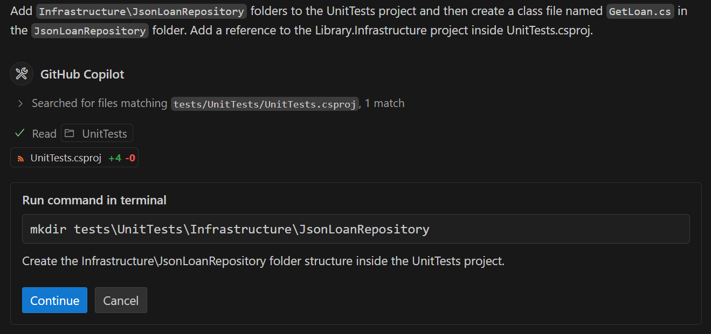

---
lab:
  title: 练习 - 使用 GitHub Copilot 开发单元测试
  description: 了解如何在 Visual Studio Code 中使用 GitHub 加速单元测试的开发。
---

# 使用 GitHub Copilot 开发单元测试

GitHub Copilot 背后的大型语言模型是基于各种代码测试框架和方案训练的。 GitHub Copilot 是生成测试用例、测试方法、测试断言和 mock 以及测试数据的绝佳工具。 在本练习中，你将使用 GitHub Copilot 加速开发 C# 应用程序的单元测试。

完成本练习大约需要 25 分钟****。

> **重要说明**：若要完成本练习，必须提供自己的 GitHub 帐户和 GitHub Copilot 订阅。 如果没有 GitHub 帐户，可以<a href="https://github.com/" target="_blank">注册</a>免费的个人帐户，并使用 GitHub Copilot 免费版计划来完成练习。 如果可以从实验室环境中访问 GitHub Copilot Pro、GitHub Copilot Pro+、GitHub Copilot Business 或 GitHub Copilot Enterprise 订阅，则可以使用你现有的 GitHub Copilot 订阅来完成本练习。

## 开始之前

实验室环境必须具备以下条件：Git 2.48 或更高版本、.NET SDK 9.0 或更高版本、带有 C# Dev Kit 扩展的 Visual Studio Code，以及启用了 GitHub Copilot 的 GitHub 帐户的访问权限。

如果你将本地电脑用作本练习的实验室环境：

- 有关将本地电脑配置为实验室环境的帮助，请在浏览器中打开以下链接：<a href="https://go.microsoft.com/fwlink/?linkid=2320147" target="_blank">配置实验室环境资源</a>。

- 有关在 Visual Studio Code 中启用 GitHub Copilot 订阅的帮助，请在浏览器中打开以下链接：<a href="https://go.microsoft.com/fwlink/?linkid=2320158" target="_blank">在 Visual Studio Code 中启用 GitHub Copilot</a>。

如果你将在本练习中使用托管实验室环境：

- 有关在 Visual Studio Code 中启用 GitHub Copilot 订阅的帮助，请将以下 URL 粘贴到浏览器的网站导航栏中：<a href="https://go.microsoft.com/fwlink/?linkid=2320158" target="_blank">在 Visual Studio Code 中启用 GitHub Copilot</a>。

- 打开命令终端，并运行以下命令：

    若要确保将 Visual Studio Code 配置为使用正确的 .NET 版本，请运行以下命令：

    ```bash

    dotnet nuget add source https://api.nuget.org/v3/index.json -n nuget.org

    ```

## 练习场景

你是在本地社区的 IT 部门工作的开发人员。 支持公共图书馆的后端系统在一场火灾中被烧毁。 你的团队需要开发一个临时解决方案，以帮助图书馆员工管理他们的运营，直到系统可以被替换为止。 你的团队已选择使用 GitHub Copilot 来加速开发流程。

你有一个图书馆应用程序的初始版本，其中包括一个名为 UnitTests 的单元测试项目。 你需要使用 GitHub Copilot 加速开发其他单元测试。

本练习包括以下任务：

1. 在 Visual Studio Code 中设置图书馆应用程序。

1. 检查 UnitTests 项目实现的单元测试方法。

1. 扩展 UnitTests 项目以开始测试 Library.Infrastructure 项目中的数据访问类。

## 在 Visual Studio Code 中设置图书馆应用程序

需要下载现有应用程序、提取代码文件，然后在 Visual Studio Code 中打开解决方案。

使用以下步骤设置图书馆应用程序：

1. 在实验室环境中打开浏览器窗口。

1. 若要下载包含图书馆应用程序的 zip 文件，请将以下 URL 粘贴到浏览器的地址栏中：[GitHub Copilot 实验室 - 开发单元测试](https://github.com/MicrosoftLearning/mslearn-github-copilot-dev/raw/refs/heads/main/DownloadableCodeProjects/Downloads/AZ2007LabAppM4.zip)

    zip 文件命名为 AZ2007LabAppM4.zip****。

1. 从 AZ2007LabAppM4.zip 文件中解压缩文件****。

    例如：

    1. 导航到实验室环境中的下载文件夹。

    1. 右键单击 AZ2007LabAppM4.zip，然后选择“全部解压缩”********。

    1. 选择“完成时显示解压缩的文件”，然后选择“解压缩”。

1. 打开提取的文件文件夹，然后将 AccelerateDevGHCopilot 文件夹复制到易于访问的位置，例如 Windows 桌面文件夹****。

1. 在 Visual Studio Code 中打开 AccelerateDevGHCopilot 文件夹****。

    例如：

    1. 在实验室环境中打开 Visual Studio Code。

    1. 在 Visual Studio Code 中的“文件”菜单上，选择“打开文件夹” 。

    1. 导航到 Windows 桌面文件夹，选择“AccelerateDevGHCopilot”，然后选择“选择文件夹”********。

1. 在 Visual Studio Code“解决方案资源管理器”视图中，验证以下解决方案结构：

    - AccelerateDevGHCopilot\
        - src\
            - Library.ApplicationCore\
            - Library.Console\
            - Library.Infrastructure\
        - tests\
            - UnitTests\

1. 确保解决方案成功生成。

    例如，在“解决方案资源管理器”视图中，右键单击“AccelerateDevGHCopilot”，然后选择“生成”********。

    你会看到一些警告，但不应该有任何错误。

## 检查 UnitTests 项目实现的单元测试方法

在练习的本节中，使用 GitHub Copilot 检查 UnitTests 项目实现的单元测试方法。

请使用以下步骤完成本练习的这一部分：

1. 在“解决方案资源管理器”视图中，展开 UnitTests 项目****。

    现有代码库包括实现以下文件夹结构的 UnitTests 项目：

    - UnitTests\
      - ApplicationCore\
        - LoanService\
          - **ExtendLoan.cs**
          - **ReturnLoan.cs**
        - PatronService\
          - **RenewMembership.cs**
      - LoanFactory.cs
      - PatronFactory.cs

    该测试项目结构反映并支持 ApplicationCore 项目的 Services 部分********。

    - ApplicationCore\
      - Services\
        - LoanService.cs：包含 ExtendLoan 和 ReturnLoan 方法********。
        - PatronService.cs：包含 RenewMembership 方法****。

1. 打开“聊天”视图。

1. 将以下文件添加到聊天上下文：

    （在 Library.ApplicationCore 项目下）

    - LoanService.cs
    - PatronService.cs

    （在 UnitTests 项目下）

    - ExtendLoan.cs
    - ReturnLoan.cs
    - RenewMembership.cs
    - LoanFactory.cs
    - PatronFactory.cs

1. 若要了解现有单元测试项目，请输入以下提示：

    ```plaintext
    @workspace Explain the approach to unit testing that's been implemented in this workspace.
    ```

    此提示要求 GitHub Copilot 说明工作区上下文中的单元测试方法。 将相关文件添加到聊天上下文可改进答复。

1. 请花点时间查看 GitHub Copilot 的回复。

    你应该会看到类似于以下示例的描述：

    ```markdown

    The unit testing approach in this workspace follows a structured and comprehensive methodology to ensure the correctness of the application's core business logic. Here's an overview of the approach:
    
    1. **Use of Test Factories**
       - Factories like PatronFactory and LoanFactory are used to create test data. These factories provide reusable methods to generate consistent and meaningful test objects, such as patrons with specific membership statuses or loans with different states (e.g., returned, current, expired).
       - This approach reduces boilerplate code in test cases and ensures that test data is consistent across different tests.
    
    2. **Mocking Dependencies**
       - **NSubstitute** is used to mock dependencies like repositories (IPatronRepository, ILoanRepository). This allows tests to isolate the behavior of the services being tested without relying on actual database or external dependencies.
       - Mocked methods are configured to return specific data or simulate certain behaviors, enabling precise control over test scenarios.
    
    3. **Service-Oriented Testing**
       - Unit tests are focused on the core services (PatronService and LoanService), which encapsulate the business logic of the application.
       - Each service method is tested for various scenarios, including success cases, edge cases, and error conditions.
    
    4. **Comprehensive Test Coverage**
       - Tests cover a wide range of scenarios for each service method:
         - **PatronService.RenewMembership:**
           - Success cases (e.g., renewing with or without loans, expired membership).
           - Failure cases (e.g., patron not found, too early to renew, overdue loans).
         - **LoanService.ReturnLoan:**
           - Success cases (e.g., returning a loan with valid conditions).
           - Failure cases (e.g., loan not found, already returned).
         - **LoanService.ExtendLoan:**
           - Success cases (e.g., extending a valid loan).
           - Failure cases (e.g., loan not found, membership expired, loan already returned or expired).
       - This ensures that all possible paths in the business logic are tested.
    
    5. **Assertions for Expected Behavior**
       - Each test uses assertions to validate the expected outcomes:
         - **Return values**: Ensuring the correct status is returned (e.g., MembershipRenewalStatus.Success, LoanReturnStatus.LoanNotFound).
         - **State changes**: Verifying that object properties (e.g., MembershipEnd, ReturnDate, DueDate) are updated correctly.
         - **Error handling**: Ensuring exceptions or errors are handled gracefully.
    
    6. **Descriptive Test Names**
       - Test methods use descriptive names and Fact attributes with DisplayName to clearly indicate the scenario being tested. This improves readability and makes it easier to understand the purpose of each test.
    
    7. **Focus on Business Logic**
       - Tests are designed to validate the business rules implemented in the services, such as:
         - Not allowing membership renewal if it's too early or if there are overdue loans.
         - Preventing loan extensions for expired memberships or already returned loans.
       - This ensures that the core functionality of the application behaves as expected under various conditions.
    
    8. **Error Simulation**
       - Tests simulate error scenarios, such as repository methods returning null or throwing exceptions, to verify that the services handle these cases appropriately.
    
    9. **Constants for Configurable Logic**
       - Constants like LoanService.ExtendByDays are used in the logic and verified in tests to ensure consistency and maintainability.
    
    **Summary**
    This workspace implements a robust unit testing strategy by leveraging test factories, mocking, and comprehensive test coverage. The focus is on isolating and validating the business logic of core services, ensuring that all possible scenarios are accounted for. This approach enhances the reliability and maintainability of the application.

    ```

1. 若要分析当前方法的优点，请输入以下提示：

    ```plaintext
    @workspace What are the benefits of this approach to unit testing?
    ```

1. 请花点时间查看 GitHub Copilot 的回复。

    你可以继续对话，并询问有关单元测试方法特定方面的详细信息。 例如，可以询问使用测试工厂、模拟依赖项或测试整体结构的好处。

1. 请花点时间考虑如何扩展现有方法来测试 Library.Infrastructure 项目。

    Library.Infrastructure 项目包含与文件系统交互以加载和保存数据的数据访问类。

1. 将以下文件添加到聊天上下文：

    （在 Library.ApplicationCore 项目下）

    - LoanService.cs
    - PatronService.cs

    （在 UnitTests 项目下）

    - ExtendLoan.cs
    - ReturnLoan.cs
    - RenewMembership.cs
    - LoanFactory.cs
    - PatronFactory.cs

1. 若要请求 GitHub Copilot 帮助扩展 UnitTests 项目，请输入以下提示：

    ```plaintext
    @workspace How can I extend the `UnitTests` project to begin testing methods in the `Library.Infrastructure` project? Provide a process overview.
    ```

    此提示要求 GitHub Copilot 提供扩展 UnitTests 项目以开始测试 Library.Infrastructure 项目中的方法的流程概述。 提示中包含多个文件，以提供响应的上下文。

1. 花点时间查看 GitHub Copilot 的响应。

    你应该会看到类似于以下示例的说明：

    ```markdown

    1. Add Project Reference:

      - Open the UnitTests.csproj file located at tests/UnitTests/UnitTests.csproj.
      - Add a reference to the Library.Infrastructure project.

    2. Identify methods to test:

      - Identify the methods in the **Library.Infrastructure** project that need to be tested. For example, if you want to test the **LoanService** class, identify the methods in the **LoanService** class that need to be tested.

    3. Create Test Classes:

      - Create new test classes in the **tests/UnitTests** directory to test the methods in the **Library.Infrastructure** project. For example, if you want to test **LoanService**, create a file named **LoanServiceTests.cs**.

    4. Write Unit Tests:

      - In the newly created test classes, write unit tests for the methods in the **Library.Infrastructure** project. Use the xUnit framework for writing tests and NSubstitute for mocking dependencies.

    5. Run Tests:

      - Use Visual Studio Code's integrated terminal or the Test Explorer to run the tests.
      - Ensure that the tests are discovered and executed correctly.

    ```

    > **提示**：使用 GitHub Copilot 的询问模式调查测试方法****。 使用答复来规划、开发或扩展单元测试。

## 扩展 UnitTests 项目以开始测试数据访问类

Library.Infrastructure 项目包含与文件系统交互以加载和保存数据的数据访问类****。 该项目包括以下类：

- JsonData：加载和保存 JSON 数据的类。
- JsonLoanRepository：实现 ILoanRepository 接口并使用 JsonData 类加载和保存贷款数据的类。
- JsonPatronRepository：实现 IPatronRepository 接口并使用 JsonData 类加载和保存顾客数据的类。

### 使用代理模式创建新的测试类

当你有一个特定任务并希望使 Copilot 能够自主编辑代码时，可以使用聊天视图的代理模式。 例如，可以使用代理模式创建和编辑文件，或调用工具来完成任务。 在代理模式下，GitHub Copilot 可以自主规划所需的工作并确定相关的文件和上下文。 然后，它会对代码库进行编辑，并调用工具来完成你发出的请求。

> 注意****：代理模式仅在 Visual Studio Code 中可用。 如果是在其他环境中使用 GitHub Copilot，则可以使用聊天模式完成类似的任务。

在本练习的本节中，你将使用 GitHub Copilot 的代理模式为 JsonLoanRepository 类的 GetLoan 方法创建新的测试类。

请使用以下步骤完成本练习的这一部分：

1. 在聊天视图中，选择“设置模式”按钮，然后选择“代理”********。

    > **重要说明**：在代理模式下使用聊天视图时，GitHub Copilot 可能会发出多个高级请求来完成单个任务。 高级请求可由用户发起的提示和 Copilot 代表你采取的后续操作使用。 使用的高级请求总数取决于任务的复杂性、所涉及的步骤数和所选的模型。

1. 若要启动自动化任务，为 JsonLoanRepository.GetLoan 方法创建测试类，请输入以下提示：

    ```plaintext

    Add `Infrastructure\JsonLoanRepository` folders to the UnitTests project. Create a class file named `GetLoan.cs` in the `JsonLoanRepository` folder and create a stub class named `GetLoan`. Add a reference to the Library.Infrastructure project inside UnitTests.csproj.

    ```

    此提示要求 GitHub Copilot 在 UnitTests 项目中创建新的文件夹结构和类文件。

    - UnitTests\
      - Infrastructure\
        - JsonLoanRepository\
          - GetLoan.cs

    该提示还要求 GitHub Copilot 在 UnitTests.csproj 文件中添加对 Library.Infrastructure 项目的引用。

1. 花点时间查看 GitHub Copilot 的响应。

    请注意聊天视图和代码编辑器中的以下更新：

    - 智能体会在完成请求的任务时显示状态消息。 第一个任务是在 UnitTests 项目中创建文件夹结构。 智能体可能会在创建文件夹结构之前暂停并要求你进行确认。

        

    - UnitTests.csproj 文件在代码编辑器中打开，编辑类似于以下更新：

        

1. 如果智能体暂停任务并请求你授予在终端中运行 make directory 命令的权限，请选择“继续”****。

    选择“继续”时，GitHub Copilot 将完成以下操作****：

    - 在终端中运行 mkdir 命令，以在 UnitTests 项目中创建 Infrastructure\JsonLoanRepository 文件夹****。
    - 在 JsonLoanRepository 文件夹中，创建一个名为 GetLoan.cs 的新文件********。

1. 花点时间来查看更新。

    你应该会在编辑器中看到以下更新：

    - UnitTests 项目现在包含对 Library.Infrastructure.csproj 的引用********。
    - GetLoan.cs 文件是在 Infrastructure\JsonLoanRepository 文件夹中创建的********。

1. 在聊天视图中，若要接受所有更改，请选择“保留”****。

1. 在“解决方案资源管理器”视图中，展开 Infrastructure\JsonLoanRepository 文件夹结构****。

    应该看到以下文件夹结构：

    - UnitTests\
      - Infrastructure\
        - JsonLoanRepository\
          - GetLoan.cs

### 使用编辑模式为 GetLoan 方法创建单元测试

在本练习的本节中，你将使用 GitHub Copilot 的编辑模式为 JsonLoanRepository 类中的 GetLoan 方法创建单元测试********。

请使用以下步骤完成本练习的这一部分：

1. 在聊天视图中，选择“设置模式”按钮，然后选择“编辑”********。

    使用编辑模式更新所选文件。 答复会以代码建议的形式显示在代码编辑器中。

1. 打开 **JsonLoanRepository.cs** 文件。

    JsonLoanRepository.cs 位于 src/Library.Infrastructure/Data/ 文件夹中********。

1. 花点时间查看 **JsonLoanRepository.cs** 文件。

    ```csharp
    using Library.ApplicationCore;
    using Library.ApplicationCore.Entities;
    
    namespace Library.Infrastructure.Data;
    
    public class JsonLoanRepository : ILoanRepository
    {
        private readonly JsonData _jsonData;
    
        public JsonLoanRepository(JsonData jsonData)
        {
            _jsonData = jsonData;
        }
    
        public async Task<Loan?> GetLoan(int id)
        {
            await _jsonData.EnsureDataLoaded();
    
            foreach (Loan loan in _jsonData.Loans!)
            {
                if (loan.Id == id)
                {
                    Loan populated = _jsonData.GetPopulatedLoan(loan);
                    return populated;
                }
            }
            return null;
        }
    
        public async Task UpdateLoan(Loan loan)
        {
            Loan? existingLoan = null;
            foreach (Loan l in _jsonData.Loans!)
            {
                if (l.Id == loan.Id)
                {
                    existingLoan = l;
                    break;
                }
            }
    
            if (existingLoan != null)
            {
                existingLoan.BookItemId = loan.BookItemId;
                existingLoan.PatronId = loan.PatronId;
                existingLoan.LoanDate = loan.LoanDate;
                existingLoan.DueDate = loan.DueDate;
                existingLoan.ReturnDate = loan.ReturnDate;
    
                await _jsonData.SaveLoans(_jsonData.Loans!);
    
                await _jsonData.LoadData();
            }
        }
    }
    ```

1. 注意以下有关 **JsonLoanRepository** 类的详细信息：

    - JsonLoanRepository 类包含两种方法****：GetLoan 和 UpdateLoan********。
    - JsonLoanRepository 类使用 JsonData 对象来加载和保存借阅数据********。

1. 请花点时间思考 GetLoan 测试类的字段和构造函数要求****。

    JsonLoanRepository.GetLoan 方法在调用时接收借阅 ID 参数****。 该方法使用 _jsonData.EnsureDataLoaded 来获取最新的 JSON 数据，并使用 _jsonData.Loans 来搜索匹配的借阅********。 如果该方法找到匹配的借阅 ID，它将返回一个已填充的借阅对象 (populated)****。 如果该方法找不到匹配的借阅 ID，则返回 null****。

    对于 GetLoan 单元测试：

    - 可以使用模拟借阅存储库对象 (_mockLoanRepository) 来帮助测试找到匹配 ID 的情况****。 使用要查找的 ID 加载模拟。 ReturnLoanTest 类演示如何模拟 ILoanRepository 接口并实例化模拟借阅存储库对象********。

    - 可使用一个非模拟借阅存储库对象 (_jsonLoanRepository) 来测试未找到匹配 ID 的情况****。 只需指定一个文件中没有的贷款 ID 即可（任何超过 100 的 ID 均可）。

    - 需要一个 JsonData 对象来创建非模拟 JsonLoanRepository 对象********。 由于 UnitTests 项目无权访问 ConsoleApp 项目创建的 JsonData 对象，因此你需要使用 IConfiguration 接口创建一个****************。

1. 打开 GetLoan.cs 测试文件并选择 GetLoan 类。

1. 将以下文件添加到聊天上下文：

    （在 Library.ApplicationCore 项目下）

    - LoanService.cs

    （在 Library.Infrastructure 项目下）

    - JsonData.cs
    - JsonLoanRepository.cs

    （在 UnitTests 项目下）

    - ReturnLoan.cs
    - LoanFactory.cs

1. 输入以下提示：

    ```plaintext

    #codebase Create fields and a class constructor for the `GetLoan.cs` file. The class will be used to create unit tests for the GetLoan method in the `JsonLoanRepository.cs` file. Create the following private readonly fields: `_mockLoanRepository`, `_jsonLoanRepository`, `_configuration`, and `_jsonData`. Instantiate the fields in the `GetLoanTest` constructor. Use `ConfigurationBuilder` to create a `_configuration` object that can be used to instantiate the JsonData object.

    ```

    此提示要求 GitHub Copilot 推荐字段和类构造函数。

1. 花点时间查看 GitHub Copilot 的响应。

    你应该会看到类似于以下代码片段的代码建议：

    ```csharp
    using NSubstitute;
    using Library.ApplicationCore;
    using Library.ApplicationCore.Entities;
    using Library.ApplicationCore.Interfaces;
    using Library.Infrastructure.Data;
    using Microsoft.Extensions.Configuration;
    
    namespace UnitTests.Infrastructure.JsonLoanRepository;
    
    public class GetLoanTest
    {
        private readonly ILoanRepository _mockLoanRepository;
        private readonly JsonLoanRepository _jsonLoanRepository;
        private readonly IConfiguration _configuration;
        private readonly JsonData _jsonData;
    
        public GetLoanTest()
        {
            _mockLoanRepository = Substitute.For<ILoanRepository>();
            _configuration = new ConfigurationBuilder()
                .AddJsonFile("appsettings.json")
                .Build();
            _jsonData = new JsonData(_configuration);
            _jsonLoanRepository = new JsonLoanRepository(_jsonData);
        }
    
        // Add test methods here
    }
    ```

1. 在聊天视图中，若要接受所有更新，请选择“保留”****。

1. 接受更新后，请检查以下问题：

    > 注意****：以下步骤中的示例代码显示更正以下问题的更新：
  
    - 如果 UnitTests.Infrastructure.JsonLoanRepository 命名空间与代码中指定的 JsonLoanRepository 类型之间存在冲突，则应更新 GetLoans.cs 中的命名空间以消除冲突********。 遵循 ReturnLoan.cs 和 RenewMembership.cs 文件中使用的模式********。

    - 如果代码中无法识别 ILoanRepository，则可能需要将 Library.ApplicationCore 的 using 指令添加到文件顶部************。

    - 如果 _configuration 对象未正确实例化，则可能需要更新包含 ConfigurationBuilder 的代码行********。 可以简化代码以使用 _configuration = new ConfigurationBuilder().Build();****。

    - 如果 GitHub Copilot 建议使用 using Library.ApplicationCore.Interfaces，则可以从文件顶部将其删除****。

1. 更新 GetLoan.cs 文件以解决在上一步中发现的问题****。

    可以使用以下代码片段作为参考：

    ```csharp
    using NSubstitute;
    using Library.ApplicationCore;
    using Library.ApplicationCore.Entities;
    using Library.Infrastructure.Data;
    using Microsoft.Extensions.Configuration;
    
    namespace UnitTests.Infrastructure.JsonLoanRepositoryTests;
    
    public class GetLoanTest
    {
        private readonly ILoanRepository _mockLoanRepository;
        private readonly JsonLoanRepository _jsonLoanRepository;
        private readonly IConfiguration _configuration;
        private readonly JsonData _jsonData;
    
        public GetLoanTest()
        {
            _mockLoanRepository = Substitute.For<ILoanRepository>();
            _configuration = new ConfigurationBuilder().Build();
            _jsonData = new JsonData(_configuration);
            _jsonLoanRepository = new JsonLoanRepository(_jsonData);
        }
    
    }
    ```

1. 将以下文件添加到聊天上下文：

    （在 Library.ApplicationCore 项目下）

    - LoanService.cs
    - Loans.json。

    （在 Library.Infrastructure 项目下）

    - JsonData.cs
    - JsonLoanRepository.cs

    （在 UnitTests 项目下）

    - ReturnLoan.cs
    - LoanFactory.cs

1. 选择 GetLoan.cs 文件的内容，然后在聊天视图中输入以下提示****：

    ```plaintext
    @workspace Update the selection to include a unit test for the `JsonLoanRepository.GetLoan` method. The unit test should test the case where a loan ID is found in the data. Use `_mockLoanRepository` to arrange the expected return loan. Use `_jsonLoanRepository` to return an actual loan. Asserts should verify that the return loan ID matches the expected loan ID. Use a loan ID that exists in the `Loans.json` file.
    ```

    此提示要求 GitHub Copilot 为 JsonLoanRepository.GetLoan 方法推荐单元测试****。 该单元测试应测试在数据中找到贷款 ID 的情况。 测试应使用 _mockLoanRepository 来安排预期的归还借阅，使用 _jsonLoanRepository 来返回实际的借阅，并使用断言来验证归还借阅 ID 是否与预期的借阅 ID 相匹配********。 借阅 ID 应存在于 Loans.json 文件中****。

1. 请花点时间查看 GitHub Copilot 建议的更新。

    你应会看到类似于以下代码片段的代码建议：

    ```csharp
    using NSubstitute;
    using Library.ApplicationCore;
    using Library.ApplicationCore.Entities;
    using Library.Infrastructure.Data;
    using Microsoft.Extensions.Configuration;
    using Xunit;
    
    namespace UnitTests.Infrastructure.JsonLoanRepositoryTests;
    
    public class GetLoanTest
    {
        private readonly ILoanRepository _mockLoanRepository;
        private readonly JsonLoanRepository _jsonLoanRepository;
        private readonly IConfiguration _configuration;
        private readonly JsonData _jsonData;
    
        public GetLoanTest()
        {
            _mockLoanRepository = Substitute.For<ILoanRepository>();
            _configuration = new ConfigurationBuilder().Build();
            _jsonData = new JsonData(_configuration);
            _jsonLoanRepository = new JsonLoanRepository(_jsonData);
        }
    
        [Fact(DisplayName = "JsonLoanRepository.GetLoan: Returns loan when loan ID is found")]
        public async Task GetLoan_ReturnsLoanWhenLoanIdIsFound()
        {
            // Arrange
            var loanId = 1; // Use a loan ID that exists in the Loans.json file
            var expectedLoan = new Loan
            {
                Id = loanId,
                BookItemId = 17,
                PatronId = 22,
                LoanDate = DateTime.Parse("2023-12-08T00:40:43.1808862"),
                DueDate = DateTime.Parse("2023-12-22T00:40:43.1808862"),
                ReturnDate = null
            };

            _mockLoanRepository.GetLoan(loanId).Returns(expectedLoan);

            // Act
            var actualLoan = await _jsonLoanRepository.GetLoan(loanId);
    
            // Assert
            Assert.NotNull(actualLoan);
            Assert.Equal(expectedLoan.Id, actualLoan?.Id);
        }
    }
    ```

1. 在聊天视图中，若要接受所有更新，请选择“保留”****。

    如果代码中无法识别 Loan 类，请确保 GetLoan.cs 文件的顶部有 using Library.ApplicationCore.Entities 语句********。 Loan 类位于 Library.ApplicationCore.Entities 命名空间中********。

1. 生成 AccelerateDevGitHubCopilot 解决方案，确保没有任何错误****。

1. 对于找不到贷款 ID 的情况，使用 GitHub Copilot 的自动完成功能创建测试。

    在 GetLoan_ReturnsLoanWhenLoanIdIsFound 方法后面创建一个空白行****。

    接受自动完成建议以创建新的测试方法。

    > 注意****：代码补全可能一次出现一行。 你可能需要多次按 Tab 或 Enter 键才能获取完整的单元测试代码********。

1. 请花点时间查看新的单元文本。

    你应该会看到类似于以下代码片段的建议单元文本：

    ```csharp

        [Fact(DisplayName = "JsonLoanRepository.GetLoan: Returns null when ID is not found")]
        public async Task GetLoan_ReturnsNullWhenIdIsNotFound()
        {
            // Arrange
            var loanId = 999; // Loan ID that does not exist in Loans.json

            _mockLoanRepository.GetLoan(loanId).Returns((Loan?)null);

            // Act
            var actualLoan = await _jsonLoanRepository.GetLoan(loanId);

            // Assert
            Assert.Null(actualLoan);
        }

    ```

    即便不需要，GitHub Copilot 的自动补全功能也可能会模拟预期借阅，因此你可以获取以下代码片段：

    ```csharp
    [Fact(DisplayName = "JsonLoanRepository.GetLoan: Returns null when loan ID is not found")]
    public async Task GetLoan_ReturnsNullWhenLoanIdIsNotFound()
    {
        // Arrange
        var loanId = 999; // Use a loan ID that does not exist in the Loans.json file
        var expectedLoan = new Loan { Id = loanId, BookItemId = 101, PatronId = 202, LoanDate = DateTime.Now, DueDate = DateTime.Now.AddDays(14) };
        _mockLoanRepository.GetLoan(loanId).Returns(expectedLoan);

        // Act
        var actualLoan = await _jsonLoanRepository.GetLoan(loanId);

        // Assert
        Assert.Null(actualLoan);
    }

    ```

    可删除模拟预期借阅的代码，但需要一个 Loans.json 文件中不存在的借阅 ID****。

    确保“找不到借阅 ID 时返回 null”单元测试分配一个不在数据集中的 loanId 值****。

1. 注意，单元测试需要对 JSON 数据文件的访问权限。

    JsonLoanRepository.GetLoan 方法使用 JsonData 对象来加载和保存借阅数据********。

    JSON 数据文件位于 Library.Console\Json 文件夹中****。 需要更新 UnitTests.csproj 文件以在测试项目中包括这些文件****。

1. 将以下 XML 代码段添加到 **UnitTests.csproj** 文件中：

    ```xml
    <ItemGroup>
        <None Include="..\..\src\Library.Console\Json\**\*">
            <Link>Json\%(RecursiveDir)%(FileName)%(Extension)</Link>
            <CopyToOutputDirectory>PreserveNewest</CopyToOutputDirectory>
        </None>
    </ItemGroup>
    ```

    这可确保在运行测试时将 JSON 数据文件复制到输出目录。

## 运行单元测试

有多种方法可运行 JsonLoanRepository 类的单元测试****。 可使用 Visual Studio Code 的测试资源管理器、集成终端或 dotnet test 命令****。

请使用以下步骤完成本练习的这一部分：

1. 确保已在编辑器中打开 GetLoans.cs 文件。

1. 生成解决方案并确保没有错误。

    右键单击“AccelerateDevGitHubCopilot”，然后选择“生成”********。

1. 注意测试方法左侧的“绿色播放按钮”。

1. 打开 Visual Studio Code 的“测试资源管理器”视图。

    若要打开“测试资源管理器”视图，请选择左侧活动栏上的烧杯状图标。 测试资源管理器在用户界面中标记为“正在测试”。

    测试资源管理器是一个树状视图，显示了工作区中的所有测试用例。 可使用测试资源管理器运行/调试测试用例并查看测试结果。

1. 展开 **UnitTests** 和基础节点，找到 **GetLoanTest**。

1. 运行“JsonLoanRepository.GetLoan：**** 找到贷款 ID 时返回贷款”测试用例。

1. 请注意，“测试资源管理器”视图和代码编辑器中会显示测试结果。

    你应会看到一个绿色复选标记，指示测试已通过。

1. 使用代码编辑器运行“JsonLoanRepository.GetLoan：**** 找不到贷款 ID 时返回 null”测试用例。

    若要从代码编辑器运行测试，请选择测试方法左侧的绿色“开始”按钮。

    请注意，“测试资源管理器”视图和代码编辑器中会显示测试结果。

    确保“JsonLoanRepository.GetLoan：**** 找不到贷款 ID 时返回 null”测试通过。 你应会在两个测试的左侧看到一个绿色的复选标记。

## 总结

在本练习中，你已了解如何使用 GitHub Copilot 加速开发 C# 应用程序中的单元测试。 你在询问模式、代理模式和编辑模式下使用了 GitHub Copilot 的聊天视图。 你使用了询问模式考察现有的单元测试方法，使用了代理模式创建项目文件夹和新测试类，并使用了编辑模式创建单元测试。 你还使用了 GitHub Copilot 的代码补全功能来创建单元测试。

## 清理

现在，你已经完成了本练习，请花点时间确保你没有对 GitHub 帐户或 GitHub Copilot 订阅做出任何你不希望保留的更改。 如果你进行了任何更改，请立即还原。
