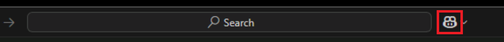

---
lab:
  title: 练习 - 使用 GitHub Copilot 重构现有代码
  description: 了解如何在 Visual Studio Code 中使用 GitHub Copilot 重构和改进现有代码段。
---

# 使用 GitHub Copilot 重构现有代码

GitHub Copilot 可用于评估整个代码库，并建议有助于重构和改进代码的更新。 在本练习中，你将使用 GitHub Copilot 重构 C# 应用程序的指定部分，同时改进代码质量、可靠性、性能和安全性。

完成此练习大约需要 30 分钟****。

> **重要说明**：若要完成本练习，必须提供自己的 GitHub 帐户和 GitHub Copilot 订阅。 如果没有 GitHub 帐户，可以<a href="https://github.com/" target="_blank">注册</a>免费的个人帐户，并使用 GitHub Copilot 免费版计划来完成练习。 如果可以从实验室环境中访问 GitHub Copilot Pro、GitHub Copilot Pro+、GitHub Copilot Business 或 GitHub Copilot Enterprise 订阅，则可以使用你现有的 GitHub Copilot 订阅来完成本练习。

## 开始之前

实验室环境必须包括以下内容：Git 2.48 或更高版本、.NET SDK 9.0 或更高版本、具有 C# 开发工具包扩展的 Visual Studio Code，以及访问启用了 GitHub Copilot 的 GitHub 帐户。

如果你将本地电脑用作本练习的实验室环境：

- 有关将本地电脑配置为实验室环境的帮助，请在浏览器中打开以下链接：<a href="https://go.microsoft.com/fwlink/?linkid=2320147" target="_blank">配置实验室环境资源</a>。

- 有关在 Visual Studio Code 中启用 GitHub Copilot 订阅的帮助，请在浏览器中打开以下链接：<a href="https://go.microsoft.com/fwlink/?linkid=2320158" target="_blank">在 Visual Studio Code 中启用 GitHub Copilot</a>。

如果你将在本练习中使用托管实验室环境：

- 有关在 Visual Studio Code 中启用 GitHub Copilot 订阅的帮助，请将以下 URL 粘贴到浏览器的网站导航栏中：<a href="https://go.microsoft.com/fwlink/?linkid=2320158" target="_blank">在 Visual Studio Code 中启用 GitHub Copilot</a>。

- 为了确保 .NET SDK 配置为使用官方 NuGet.org 存储库作为下载和还原包的源：

    打开命令终端，然后运行以下命令：

    ```bash

    dotnet nuget add source https://api.nuget.org/v3/index.json -n nuget.org

    ```

## 练习场景

你是一名在当地社区 IT 部门工作的开发人员。 支持公共图书馆的后端系统在火灾中丢失。 你的团队需要开发一个临时解决方案，帮助图书馆员工管理其操作，直到可以更换系统。 你的团队选择使用 GitHub Copilot 来加速开发流程。

你提交了图书馆应用程序的初始版本以待评审。 评审团队确定了可提升代码质量、性能、可读性、可维护性和安全性的方面。

系统会分配以下更新：

1. 将 EnumHelper 类重构为使用静态字典，而不是反射。

    - 使用静态字典可以提高性能（消除反射的开销）。
    - 消除反射还可以提高代码可读性、可维护性和安全性。

1. 重构数据访问方法以使用 LINQ（语言集成查询），而不是 foreach 循环。

    - 使用 LINQ 可以更简洁、更易读地查询集合、数据库和 XML 文档。
    - 使用 LINQ 可以提高代码可读性、可维护性和性能。

本练习包括以下任务：

1. 在 Visual Studio Code 中设置图书馆应用程序。
1. 在“询问”和“编辑”模式下使用聊天视图来分析和重构代码。
1. 在“编辑”和“智能体”模式下使用内联聊天和聊天视图来重构代码。

## 在 Visual Studio Code 中设置图书馆应用程序

需要下载现有应用程序、提取代码文件，然后在 Visual Studio Code 中打开解决方案。

使用以下步骤设置图书馆应用程序：

1. 在实验室环境中打开浏览器窗口。

1. 若要下载包含图书馆应用程序的 zip 文件，请将以下 URL 粘贴到浏览器的地址栏中：[GitHub Copilot 实验室 - 重构现有代码](https://github.com/MicrosoftLearning/mslearn-github-copilot-dev/raw/refs/heads/main/DownloadableCodeProjects/Downloads/AZ2007LabAppM5.zip)

    zip 文件命名为 AZ2007LabAppM5.zip****。

1. 从 AZ2007LabAppM5.zip 文件中解压缩文件****。

    例如：

    1. 导航到实验室环境中的 downloads 文件夹。

    1. 右键单击 AZ2007LabAppM5.zip，然后选择“全部解压缩”********。

    1. 选择“完成时显示解压缩的文件”，然后选择“解压缩”。

1. 打开解压缩的 files 文件夹，然后将 AccelerateDevGHCopilot 文件夹复制到易于访问的位置，例如 Windows Desktop 文件夹****。

1. 在 Visual Studio Code 中打开 AccelerateDevGHCopilot 文件夹****。

    例如：

    1. 在实验室环境中打开 Visual Studio Code。

    1. 在 Visual Studio Code 中的“文件”菜单上，选择“打开文件夹” 。

    1. 导航到 Windows 桌面文件夹，选择“AccelerateDevGHCopilot”，然后选择“选择文件夹”********。

1. 在 Visual Studio Code“解决方案资源管理器”视图中，验证以下解决方案结构：

    - AccelerateDevGHCopilot\
        - src\
            - Library.ApplicationCore\
            - Library.Console\
            - Library.Infrastructure\
        - tests\
            - UnitTests\

1. 确保解决方案成功生成。

    例如，在“解决方案资源管理器”视图中，右键单击“AccelerateDevGHCopilot”，然后选择“生成”********。

    你将看到多个警告，但不应出现任何错误。

## 在“询问”和“编辑”模式下使用聊天视图分析和重构代码

反射是一项强大的编码功能，可用于在运行时检查和操作对象。 但是，反射可能很慢，并且存在与应考虑的反射相关的潜在安全风险。

你需要：

1. 分析工作区并调查如何解决已分配的任务。
1. 将 EnumHelper 类重构为使用静态字典，而不是反射。

### 在“询问”模式下使用聊天视图分析 EnumHelper 类

GitHub Copilot 的聊天视图有三种模式：“询问”、“编辑”和“智能体”************。 每个模式专为与 GitHub Copilot 进行不同类型的交互而设计。

- **** 询问：使用此模式可以向 GitHub Copilot 询问关于代码库的问题。 可以要求 GitHub Copilot 解释代码、提供更改建议或提供有关代码库的信息。
- 编辑****：使用此模式可以编辑所选的代码文件。 可以使用 GitHub Copilot 重构代码、添加注释或对代码执行其他更改。
- 代理****：使用此模式可以以智能体身份运行 GitHub Copilot。 可以使用 GitHub Copilot 运行命令、执行代码或在工作区中执行其他任务。

在该练习的本部分中，将在“询问”模式下使用聊天视图来分析编码分配。

请使用以下步骤完成本练习的这一部分：

1. 在“解决方案资源管理器”视图中，展开 Library.ApplicationCore 文件夹，然后展开 Enums 文件夹********。

1. 打开 EnumHelper.cs 文件并查看现有代码。

    ```csharp
    using System.ComponentModel;
    using System.Reflection;
    
    namespace Library.ApplicationCore.Enums;
    
    public static class EnumHelper
    {
        public static string GetDescription(Enum value)
        {
            if (value == null)
                return string.Empty;
    
            FieldInfo fieldInfo = value.GetType().GetField(value.ToString())!;
    
            DescriptionAttribute[] attributes =
                (DescriptionAttribute[])fieldInfo.GetCustomAttributes(typeof(DescriptionAttribute), false);
    
            if (attributes != null && attributes.Length > 0)
            {
                return attributes[0].Description;
            }
            else
            {
                return value.ToString();
            }
        }
    }
    ```

1. 打开 GitHub Copilot 聊天视图。

    聊天视图提供一个托管对话界面，用于与 GitHub Copilot 交互。

    可以使用位于 Visual Studio Code 窗口顶部的“切换聊天”按钮（位于搜索文本框右侧）将聊天视图在打开或关闭之间切换****。

    

    还可以使用键盘快捷方式 Ctrl+Alt+I 切换聊天视图****。

1. 请注意，聊天视图默认在“询问”模式下打开****。

    当前聊天模式显示在聊天视图右下角附近。 在“询问”模式下工作时，聊天视图中会显示聊天响应****。

1. 选择 EnumHelper.cs 文件中的代码。

1. 查看并提交以下提示：

    ```plaintext
    @workspace Explain how the GetDescription method uses reflection to assign the return value.
    ```

1. 请花点时间查看更新。

    GetDescription 方法使用反射来检索名为 value 的枚举参数的说明属性********。

    该方法检查 value 参数是否为 null****。 如果是，该方法将返回一个空字符串。 否则，它将使用反射来获取枚举值的字段信息，并检索 DescriptionAttribute 类型的属性****。 如果找到任何属性，它将返回说明；否则，它将返回枚举值的字符串表示形式。

1. 查看并提交以下提示：

    ```plaintext
    @workspace Which files in this workspace are used to store the enum values passed to the GetDescription method?
    ```

    响应应告知你检查 Enums 文件夹。 枚举值在 LoanExtensionStatus、LoanReturnStatus 和 MembershipRenewalStatus 文件中定义************。

1. 将以下文件添加到聊天上下文：

    - EnumHelper.cs
    - LoanExtensionStatus.cs
    - LoanReturnStatus.cs
    - MembershipRenewalStatus.cs

    可以使用拖放操作将 Visual Studio Code 资源管理器视图中的文件添加到聊天视图。 还可以使用聊天视图中的“添加上下文”按钮添加文件和其他资源****。

    > 注意****：将文件添加到聊天上下文可确保 GitHub Copilot 在生成响应时考虑这些文件。 当 GitHub Copilot 了解与提示关联的上下文时，响应的相关性和准确性会提高。

1. 查看并提交以下提示：

    ```plaintext

    @workspace I need to refactor the `EnumHelper` class and remove any code that uses reflection. Use static dictionaries to supply enum description attributes. Use a separate dictionary for each enum. The dictionaries should use values from the `LoanExtensionStatus.cs`, `LoanReturnStatus.cs`, and `MembershipRenewalStatus.cs` files. Explain how to update the EnumHelper class using dictionaries and show me the updated code.

    ```

    编写任何提示时，清晰度和上下文都非常重要。 使用聊天参与者、斜杠命令和聊天变量有助于定义 GitHub Copilot 可以理解的上下文。

    编写提示以询问 GitHub Copilot 如何解决问题时，请首先说明要解决的问题。 使用简洁的句子来描述详细信息、指定约束和标识资源。 最后，请务必告诉 GitHub Copilot 响应中要包含的内容。

    在本例中，提示中应首先描述问题/目标。 告知 GitHub Copilot，你需要重构 EnumHelper 类并移除使用反射的任何代码****。 告知 GitHub Copilot，你希望使用字典来提供枚举描述属性。 说明每个枚举需要单独的字典，并告知 GitHub Copilot，枚举值应源自你命名的文件。 最后，请 GitHub Copilot 说明如何更新 EnumHelper 类，并说明你需要包含更新代码的代码示例****。

1. 请花点时间查看 GitHub Copilot 提供的响应。

    响应应类似于以下 markdown 和代码示例：

    ```markdown

    To refactor the EnumHelper class and remove reflection, you can create static dictionaries for each enum type. These dictionaries will map each enum value to its description. The dictionaries will be initialized with the descriptions defined in the Description attributes of the enums.

    Here's how to update the **EnumHelper** class:

    1. Create a static dictionary for each enum (LoanExtensionStatus, LoanReturnStatus, and MembershipRenewalStatus).
    2. Populate these dictionaries with the enum values as keys and their descriptions as values.
    3. Update the GetDescription method to retrieve the description from the appropriate dictionary based on the enum type.

    Here’s the updated code:

    ```

    ```csharp

    using System.Collections.Generic;
    
    namespace Library.ApplicationCore.Enums;
    
    public static class EnumHelper
    {
        private static readonly Dictionary<LoanExtensionStatus, string> LoanExtensionStatusDescriptions = new()
        {
            { LoanExtensionStatus.Success, "Book loan extension was successful." },
            { LoanExtensionStatus.LoanNotFound, "Loan not found." },
            { LoanExtensionStatus.LoanExpired, "Cannot extend book loan as it already has expired. Return the book instead." },
            { LoanExtensionStatus.MembershipExpired, "Cannot extend book loan due to expired patron's membership." },
            { LoanExtensionStatus.LoanReturned, "Cannot extend book loan as the book is already returned." },
            { LoanExtensionStatus.Error, "Cannot extend book loan due to an error." }
        };
    
        private static readonly Dictionary<LoanReturnStatus, string> LoanReturnStatusDescriptions = new()
        {
            { LoanReturnStatus.Success, "Book was successfully returned." },
            { LoanReturnStatus.LoanNotFound, "Loan not found." },
            { LoanReturnStatus.AlreadyReturned, "Cannot return book as the book is already returned." },
            { LoanReturnStatus.Error, "Cannot return book due to an error." }
        };
    
        private static readonly Dictionary<MembershipRenewalStatus, string> MembershipRenewalStatusDescriptions = new()
        {
            { MembershipRenewalStatus.Success, "Membership renewal was successful." },
            { MembershipRenewalStatus.PatronNotFound, "Patron not found." },
            { MembershipRenewalStatus.TooEarlyToRenew, "It is too early to renew the membership." },
            { MembershipRenewalStatus.LoanNotReturned, "Cannot renew membership due to an outstanding loan." },
            { MembershipRenewalStatus.Error, "Cannot renew membership due to an error." }
        };
    
        public static string GetDescription<TEnum>(TEnum value) where TEnum : Enum
        {
            return value switch
            {
                LoanExtensionStatus loanExtensionStatus => LoanExtensionStatusDescriptions[loanExtensionStatus],
                LoanReturnStatus loanReturnStatus => LoanReturnStatusDescriptions[loanReturnStatus],
                MembershipRenewalStatus membershipRenewalStatus => MembershipRenewalStatusDescriptions[membershipRenewalStatus],
                _ => value.ToString()
            };
        }
    }

    ```

    ```markdown

    Explanation:
    
    1. Static Dictionaries: Each dictionary is specific to an enum type and maps enum values to their descriptions.
    2. Generic Method: The GetDescription method is now generic and uses a switch expression to determine which dictionary to use based on the enum type.
    3. No Reflection: The use of reflection is completely removed, improving performance and type safety.
    
    This approach ensures that the descriptions are statically defined and avoids the runtime overhead of reflection.

    ```

1. 在聊天视图中，将鼠标指针悬停在响应中包含的代码示例上。

1. 请注意代码片段右上角显示的三个按钮。

1. 将鼠标指针悬停在每个按钮上，查看描述操作的工具提示。

    前两个按钮可将代码复制到编辑器。 第三个按钮可将代码复制到剪贴板。

> 注意****：可以使用“询问”模式更新 EnumHelper 类****。 但是，“编辑”模式可直接在代码编辑器中重构代码，并提供用于接受更新的更多选项。

### 使用“编辑”模式下的聊天视图来重构 EnumHelper 类

聊天视图的“编辑”模式用于编辑工作区中的代码。 可以使用“编辑”模式重构代码、添加注释或对代码执行其他更改。

1. 在聊天视图中，选择“设置模式”，然后选择“编辑”********。

    当系统提示在“编辑”模式下启动新会话时，选择“是”****。

    在“编辑”模式下，GitHub Copilot 会在代码编辑器中将响应显示为代码更新建议****。 实现新功能、修复 bug 或重构代码时，通常会使用“编辑”模式。

1. 将以下文件添加到聊天上下文：

    - EnumHelper.cs
    - LoanExtensionStatus.cs
    - LoanReturnStatus.cs
    - MembershipRenewalStatus.cs

1. 查看并提交以下提示：

    ```plaintext

    #codebase I need to refactor the `EnumHelper` class and remove any code that uses reflection. Use static dictionaries to supply enum description attributes. Use a separate dictionary for each enum. The dictionaries should use values from the `LoanExtensionStatus.cs`, `LoanReturnStatus.cs`, and `MembershipRenewalStatus.cs` files.

    ```

    此提示告知 GitHub Copilot 使用字典重构 EnumHelper 类，而不是使用反射来分配枚举说明属性****。 它指定应为每个枚举使用单独的字典，并且枚举值应源自特定文件。

1. 请花点时间查看建议的代码更新。

    查看建议的更新，确保枚举值来自 LoanExtensionStatus.cs、LoanReturnStatus.cs 和 MembershipRenewalStatus.cs 文件************。

    可以打开每个枚举文件，验证字典中的枚举值是否正确。 如果发现差异，请让 GitHub Copilot 分别为每个枚举更新字典。 例如，可以对 LoanExtensionStatus 枚举使用以下提示****：

    ```plaintext

    #codebase Use the description values in LoanExtensionStatus.cs to update the LoanExtensionStatus dictionary in the EnumHelper class. Provide the updated code for the LoanExtensionStatus dictionary in the EnumHelper class.

    ```

1. 在聊天视图中，要接受所有更新，请选择“保留”****。

    还可以使用“代码编辑器”选项卡底部附近的“聊天编辑”工具栏来接受或拒绝代码更新。

1. 请花点时间查看更新的 GetDescription 方法****。

    GitHub Copilot 应已将 GetDescription 方法更新为使用模式匹配和静态字典，而不是反射****。 更新的方法应类似于以下示例之一：

    ```csharp

    public static string GetDescription(Enum value)
    {
        if (value == null)
            return string.Empty;

        // Use type checks to select the correct dictionary
        if (value is LoanExtensionStatus les && LoanExtensionStatusDescriptions.TryGetValue(les, out var lesDesc))
            return lesDesc;
        if (value is LoanReturnStatus lrs && LoanReturnStatusDescriptions.TryGetValue(lrs, out var lrsDesc))
            return lrsDesc;
        if (value is MembershipRenewalStatus mrs && MembershipRenewalStatusDescriptions.TryGetValue(mrs, out var mrsDesc))
            return mrsDesc;

        return value.ToString();
    }

    ```

    或

    ```csharp

    public static string GetDescription<TEnum>(TEnum value) where TEnum : Enum
    {
        return value switch
        {
            MembershipRenewalStatus status => MembershipRenewalDescriptions.TryGetValue(status, out var description) ? description : status.ToString(),
            LoanReturnStatus status => LoanReturnDescriptions.TryGetValue(status, out var description) ? description : status.ToString(),
            LoanExtensionStatus status => LoanExtensionDescriptions.TryGetValue(status, out var description) ? description : status.ToString(),
            _ => value.ToString()
        };
    }

    ```

    此代码使用模式匹配来确定枚举的类型，并从相应的字典中检索说明。 switch 语句会检查枚举值的类型，并从字典中返回相应的说明********。 如果在字典中找不到枚举值，该方法将回退到对枚举值调用 ToString()，这会将枚举成员的名称作为字符串返回。

    如果要求 GitHub Copilot 重构 GetDescription 方法以避免使用 lambda 表达式，则基础逻辑更易于遵循：

    ```csharp

    public static string GetDescription<TEnum>(TEnum value) where TEnum : Enum
    {
        switch (value)
        {
            case MembershipRenewalStatus status:
                string membershipDescription;
                if (MembershipRenewalDescriptions.TryGetValue(status, out membershipDescription))
                {
                    return membershipDescription;
                }
                return status.ToString();

            case LoanReturnStatus status:
                string loanReturnDescription;
                if (LoanReturnDescriptions.TryGetValue(status, out loanReturnDescription))
                {
                    return loanReturnDescription;
                }
                return status.ToString();

            case LoanExtensionStatus status:
                string loanExtensionDescription;
                if (LoanExtensionDescriptions.TryGetValue(status, out loanExtensionDescription))
                {
                    return loanExtensionDescription;
                }
                return status.ToString();

            default:
                return value.ToString();
        }
    }

    ```

1. 生成解决方案以确保不会引入错误。

    你将看到在本练习开始时出现的相同警告，但不应显示任何错误消息。

## 在“编辑”和“智能体”模式下使用内联聊天和聊天视图来重构代码

LINQ 是 C# 中的一项强大功能，可用于以统一的方式查询集合、数据库和 XML 文档。 与传统的 foreach 循环相比，LINQ 提供了一种更简洁、更易读的方式来查询数据。

本练习的本部分包括以下任务：

- 使用内联聊天重构 JsonData 类。
- 在“编辑”模式下使用聊天视图重构 JsonLoanRepository 类。
- 在“智能体”模式下使用聊天视图重构 JsonPatronRepository 类。

### 使用内联聊天重构 JsonData 类

JsonData 类包括以下数据访问方法：GetPopulatedPatron、GetPopulatedLoan、GetPopulatedBookItem、GetPopulatedBook。 这些方法使用 foreach 循环来循环访问集合并填充对象。 可以重构这些方法，以使用 LINQ 来提高代码可读性和可维护性。

请使用以下步骤完成本练习的这一部分：

1. 在“解决方案资源管理器”视图中，展开 Library.Infrastructure 项目，然后展开 Data 文件夹********。

1. 打开 JsonData.cs 文件。

1. 向下滚动，找到 GetPopulatedPatron 方法****。

    GetPopulatedPatron 方法旨在创建一个完全填充的图书馆 Patron 对象********。 它复制 Patron 的基本属性，并使用详细的 Loan 对象填充其 Loans 集合************。

1. 选择 **GetPopulatedPatron** 方法。

    ```csharp

    public Patron GetPopulatedPatron(Patron p)
    {
        Patron populated = new Patron
        {
            Id = p.Id,
            Name = p.Name,
            ImageName = p.ImageName,
            MembershipStart = p.MembershipStart,
            MembershipEnd = p.MembershipEnd,
            Loans = new List<Loan>()
        };

        foreach (Loan loan in Loans!)
        {
            if (loan.PatronId == p.Id)
            {
                populated.Loans.Add(GetPopulatedLoan(loan));
            }
        }

        return populated;
    }

    ```

1. 打开内联聊天，然后使用 LINQ 输入重构方法的提示。

    ```plaintext
    #selection refactor selection to `return new Patron` using LINQ
    ```

1. 请花点时间来查看建议的更新。

    建议的更新看起来应类似于以下代码：

    ```csharp
    public Patron GetPopulatedPatron(Patron p)
    {
        return new Patron
        {
            Id = p.Id,
            Name = p.Name,
            ImageName = p.ImageName,
            MembershipStart = p.MembershipStart,
            MembershipEnd = p.MembershipEnd,
            Loans = Loans!
                .Where(loan => loan.PatronId == p.Id)
                .Select(GetPopulatedLoan)
                .ToList()
        };
    }
    ```

    请注意，LINQ 查询用于替换 foreach 循环。

    LINQ 代码使用对象初始值设定项将对象属性分配给新的 Patron 对象****。 这使 Patron 对象不再需要单独填充的实例********。 总的来说，更新的代码更短且更易于阅读。

    该代码使用借阅者“p”将一些基本属性分配给新的 Patron 对象********。 然后，它使用与 Patron 参数“p”关联的借阅填充 Loans 集合，并使用 GetPopulatedLoan 方法转换每个借阅************。

    可以分解填充 Loans 集合的 LINQ 代码行****：

    - Loans!****：Loans!**** 表达式用于访问 Loans 集合****。 重载 **!** 运算符是一个允许为 null 的运算符，表示开发人员确信 Loans 不为 null****。 调用 GetPopulatedPatron 方法前，应确保 Loans 已正确初始化********。

    - .Where(loan => loan.PatronId == p.Id)****：此代码筛选借阅，仅包含属于输入借阅者“p”的借阅****。

    - .Select(GetPopulatedLoan)****：此代码使用 GetPopulatedLoan 方法转换每个筛选的借阅****。

    - .ToList()****：将结果转换为“列出\<Loan\>”****。

1. 若要接受建议的更新，请选择“接受”****。

    你将使用相同的方法来重构另外三种方法。

1. 使用相同的方法重构 **GetPopulatedLoan**、**GetPopulatedBookItem** 和 **GetPopulatedBook** 方法。

    例如，使用以下提示重构三种方法：

    对于 **GetPopulatedLoan** 方法：

    ```plaintext

    #selection refactor selection to `return new Loan` using LINQ. Use `GetPopulatedBookItem` for the `BookItem` property. Use `Single` for BookItem and Patron properties.

    ```

    对于 **GetPopulatedBookItem** 方法：

    ```plaintext

    #selection refactor selection to `return new BookItem` using LINQ. Use `GetPopulatedBook` and `Single` for the `BookItem` property.

    ```

    对于 **GetPopulatedBook** 方法：

    ```plaintext

    #selection refactor selection to `return new Book` using LINQ. Use `Where` and `Select` for `Author` property. Use `First` author.

    ```

1. 接受建议的更新后，花时间查看代码更改。

    更新后的代码应类似于以下代码：

    ```csharp
    public Loan GetPopulatedLoan(Loan l)
    {
        return new Loan
        {
            Id = l.Id,
            BookItemId = l.BookItemId,
            PatronId = l.PatronId,
            LoanDate = l.LoanDate,
            DueDate = l.DueDate,
            ReturnDate = l.ReturnDate,
            BookItem = GetPopulatedBookItem(BookItems!.Single(bi => bi.Id == l.BookItemId)),
            Patron = Patrons!.Single(p => p.Id == l.PatronId)
        };
    }

    public BookItem GetPopulatedBookItem(BookItem bi)
    {
        return new BookItem
        {
            Id = bi.Id,
            BookId = bi.BookId,
            AcquisitionDate = bi.AcquisitionDate,
            Condition = bi.Condition,
            Book = GetPopulatedBook(Books!.Single(b => b.Id == bi.BookId))
        };
    }

    public Book GetPopulatedBook(Book b)
    {
        return new Book
        {
            Id = b.Id,
            Title = b.Title,
            AuthorId = b.AuthorId,
            Genre = b.Genre,
            ISBN = b.ISBN,
            ImageName = b.ImageName,
            Author = Authors!.Where(a => a.Id == b.AuthorId).Select(a => new Author {
                Id = a.Id,
                Name = a.Name
            }).First()
        };
    }
    ```

1. 使用“说明”**** 智能操作查看 LINQ 查询的说明。

    若要打开“说明”智能操作，请在编辑器中选择代码，右键单击所选代码，选择 Copilot，然后选择“说明”********。 “说明”智能操作提供对所选代码的详细说明****。 在本例中，代码中使用 LINQ 查询。

    例如，可以对 GetPopulatedBook 方法使用“说明”智能操作，以查看对用于填充 Book 对象 Author 属性的 LINQ 查询的说明****************。

    ```csharp
    Author = Authors!.Where(a => a.Id == b.AuthorId).Select(a => new Author {
        Id = a.Id,
        Name = a.Name
    }).First()
    ```

    “说明”智能操作提供用于填充 Book 对象 Author 属性的 LINQ 查询的详细说明************。

    例如，说明可能类似这样：

    ```plaintext

    The active selection is a C# code snippet that assigns a value to the Author property. This value is derived from a collection of Author objects named Authors. The code uses LINQ to filter and transform the data within this collection.
    
    First, the Authors! expression uses the null-forgiving operator (!) to indicate that Authors is not null, even if the compiler might think otherwise. This is a way to suppress nullable warnings. The Where method is then called on the Authors collection to filter the elements. The lambda expression a => a.Id == b.AuthorId is used to find all Author objects where the Id matches the AuthorId property of another object b.
    
    After filtering, the Select method is used to project each filtered Author object into a new Author object. This is done by creating a new instance of the Author class and copying the Id and Name properties from the original Author object.
    
    Finally, the First method is called to retrieve the first element from the resulting sequence. This means that the Author property will be assigned the first Author object that matches the filter criteria and has been projected into a new Author instance.
    
    This approach ensures that the Author property is set to a new Author object with the same Id and Name as the first matching Author in the Authors collection.

    ```

1. 生成解决方案以确保不会出现错误。

### 在“编辑”模式下使用聊天视图重构 JsonLoanRepository 类

JsonLoanRepository 类包括 GetLoan 和 UpdateLoan 数据访问方法********。 你将重构这两种方法，将 foreach 循环替换为 LINQ，以提高代码可读性和可维护性。

请使用以下步骤完成本练习的这一部分：

1. 打开 **JsonLoanRepository.cs** 文件。

1. 选择 **GetLoan** 方法。

    GetLoan 方法旨在按借阅 ID 检索借阅****。

    ```csharp
    public async Task<Loan?> GetLoan(int id)
    {
        await _jsonData.EnsureDataLoaded();

        foreach (Loan loan in _jsonData.Loans!)
        {
            if (loan.Id == id)
            {
                Loan populated = _jsonData.GetPopulatedLoan(loan);
                return populated;
            }
        }

        return null;
    }
    ```

1. 确保聊天视图在“编辑”模式下打开****。

    如果聊天视图未打开，请选择“切换聊天”，将模式设置为“编辑”********。

1. 输入使用 LINQ 重构方法的提示。

    例如，输入以下提示：

    ```plaintext
    refactor the foreach using LINQ. Use Where, Select, and GetPopulatedLoan return the first matching loan.
    ```

1. 请花点时间来查看建议的更新。

    建议的更新看起来应类似于以下代码：

    ```csharp
    public async Task<Loan?> GetLoan(int id)
    {
        await _jsonData.EnsureDataLoaded();

        return _jsonData.Loans!
            .Where(l => l.Id == id)
            .Select(l => _jsonData.GetPopulatedLoan(l))
            .FirstOrDefault();

    }
    ```

    更新的代码使用 LINQ 筛选借阅集合，以仅包含具有指定 ID 的借阅。 请注意，应将“借阅”声明为可为 null (Loan? loan)********。 然后，它使用 GetPopulatedLoan 方法转换借阅，并返回第一个结果****。 如果未找到匹配的借阅，FirstOrDefault 将返回 null********。 然后，该方法返回此借阅对象，如果没有具有指定 ID 的借阅，该对象可能为 null****。 此方法可确保返回的借阅完全填充所有必要的相关数据，从而全面了解借阅记录。

    GitHub Copilot 还可能建议以下代码（在功能上等效）：

    ```csharp
    public async Task<Loan?> GetLoan(int id)
    {
        await _jsonData.EnsureDataLoaded();

        Loan? loan = _jsonData.Loans!
            .Where(l => l.Id == id)
            .Select(l => _jsonData.GetPopulatedLoan(l))
            .FirstOrDefault();

        return loan;
    }
    ```

1. 若要接受更新后的 GetLoan 方法，请选择“保留”****。

1. 选择 **UpdateLoan** 方法。

    ```csharp
    public async Task UpdateLoan(Loan loan)
    {
        Loan? existingLoan = null;
        foreach (Loan l in _jsonData.Loans!)
        {
            if (l.Id == loan.Id)
            {
                existingLoan = l;
                break;
            }
        }

        if (existingLoan != null)
        {
            existingLoan.BookItemId = loan.BookItemId;
            existingLoan.PatronId = loan.PatronId;
            existingLoan.LoanDate = loan.LoanDate;
            existingLoan.DueDate = loan.DueDate;
            existingLoan.ReturnDate = loan.ReturnDate;

            await _jsonData.SaveLoans(_jsonData.Loans!);

            await _jsonData.LoadData();
        }
    }
    ```

1. 输入使用 LINQ 重构方法的提示。

    例如，输入以下提示：

    ```plaintext

    refactor selection using LINQ. find existing loan in `_jsonData.Loans!. replace existing loan.

    ```

1. 请花点时间来查看建议的更新。

    建议的更新应类似于以下示例之一：

    ```csharp

    public async Task UpdateLoan(Loan loan)
    {
        var loans = _jsonData.Loans!;
        var index = loans.FindIndex(l => l.Id == loan.Id);

        if (index >= 0)
        {
            loans[index] = loan;
            await _jsonData.SaveLoans(loans);
            await _jsonData.LoadData();
        }
    }

    ```

    或

    ```csharp

    public async Task UpdateLoan(Loan loan)
    {
        Loan? existingLoan = _jsonData.Loans!.FirstOrDefault(l => l.Id == loan.Id);

        if (existingLoan != null)
        {
            existingLoan.BookItemId = loan.BookItemId;
            existingLoan.PatronId = loan.PatronId;
            existingLoan.LoanDate = loan.LoanDate;
            existingLoan.DueDate = loan.DueDate;
            existingLoan.ReturnDate = loan.ReturnDate;

            await _jsonData.SaveLoans(_jsonData.Loans!);

            await _jsonData.LoadData();
        }
    }

    ```

    更新的代码使用 LINQ 查找借阅集合中的现有借阅。 然后，它会使用新的借阅数据更新现有借阅。 然后，该方法保存更新后的借阅集合，并重新加载数据。 此方法可确保正确更新借阅数据，并将更改保存到数据存储。

    还可以添加代码，以确保在执行方法之前加载数据：

    ```csharp

    public async Task UpdateLoan(Loan loan)
    {
        await _jsonData.EnsureDataLoaded();

        Loan? existingLoan = _jsonData.Loans!.FirstOrDefault(l => l.Id == loan.Id);

        if (existingLoan != null)
        {
            existingLoan.BookItemId = loan.BookItemId;
            existingLoan.PatronId = loan.PatronId;
            existingLoan.LoanDate = loan.LoanDate;
            existingLoan.DueDate = loan.DueDate;
            existingLoan.ReturnDate = loan.ReturnDate;

            await _jsonData.SaveLoans(_jsonData.Loans!);

            await _jsonData.LoadData();
        }
    }

    ```

1. 若要接受更新后的 UpdateLoan 方法，请选择“保留”****。

1. 生成解决方案以确保未引入任何错误。

    你将看到警告。 现在可以忽略这些文件。

### 在“智能体”模式下使用聊天视图重构 JsonPatronRepository 类

JsonPatronRepository 类包含以下三种方法****：

- SearchPatrons：SearchPatrons 方法用于按姓名搜索借阅者。 此方法返回已排序的借阅者列表。
- GetPatron：GetPatron 方法用于按 ID 检索借阅者。 此方法返回填充的 patron 对象。
- UpdatePatron：UpdatePatron 方法用于更新借阅者的信息。 此方法使用新数据更新现有借阅者，并保存更新后的借阅者集合。

这三种方法均使用 foreach 循环来循环访问借阅者，并根据搜索输入或 ID 查找匹配项。

你将在“智能体”模式下使用聊天视图重构方法，将 foreach 循环替换为 LINQ 查询，与用于 JsonData 和 JsonLoanRepository 类的操作方法相同********。

请使用以下步骤完成本练习的这一部分：

1. 打开 **JsonPatronRepository.cs** 文件。

    JsonPatronRepository 类旨在管理图书馆借阅者****。

1. 请花点时间查看 JsonPatronRepository 类中包含的三种方法****。

    SearchPatrons 方法旨在按姓名搜索借阅者****。

    ```csharp

    public async Task<List<Patron>> SearchPatrons(string searchInput)
    {
        await _jsonData.EnsureDataLoaded();

        List<Patron> searchResults = new List<Patron>();
        foreach (Patron patron in _jsonData.Patrons)
        {
            if (patron.Name.Contains(searchInput))
            {
                searchResults.Add(patron);
            }
        }
        searchResults.Sort((p1, p2) => String.Compare(p1.Name, p2.Name));

        searchResults = _jsonData.GetPopulatedPatrons(searchResults);

        return searchResults;
    }

    ```

    请注意，SearchPatrons 方法使用 foreach 循环来循环访问借阅者，并根据 searchInput 字符串查找匹配项********。 然后，该方法按姓名对结果进行排序，并返回填充的借阅者列表。

    GetPatron 方法旨在返回与指定“id”匹配的借阅者********。

    ```csharp

    public async Task<Patron?> GetPatron(int id)
    {
        await _jsonData.EnsureDataLoaded();

        foreach (Patron patron in _jsonData.Patrons!)
        {
            if (patron.Id == id)
            {
                Patron populated = _jsonData.GetPopulatedPatron(patron);
                return populated;
            }
        }
        return null;
    }

    ```

    请注意，GetPatron 方法使用 foreach 循环来循环访问借阅者，并根据“id”参数查找匹配项********。 然后，该方法将返回填充的 patron 对象。

    UpdatePatron 方法旨在更新具有指定“id”的借阅者********。

    ```csharp

    public async Task UpdatePatron(Patron patron)
    {
        await _jsonData.EnsureDataLoaded();
        var patrons = _jsonData.Patrons!;
        Patron existingPatron = null;
        foreach (var p in patrons)
        {
            if (p.Id == patron.Id)
            {
                existingPatron = p;
                break;
            }
        }
        if (existingPatron != null)
        {
            existingPatron.Name = patron.Name;
            existingPatron.ImageName = patron.ImageName;
            existingPatron.MembershipStart = patron.MembershipStart;
            existingPatron.MembershipEnd = patron.MembershipEnd;
            existingPatron.Loans = patron.Loans;
            await _jsonData.SavePatrons(patrons);
            await _jsonData.LoadData();
        }
    }

    ```

    请注意，UpdatePatron 方法使用 foreach 循环来循环访问借阅者，并根据“id”参数查找匹配项********。 此方法随后使用新数据更新现有借阅者，并保存更新后的借阅者集合。

1. 在聊天视图中，将模式更改为“智能体”****

    “智能体”模式旨在将 GitHub Copilot 作为智能体运行。 可以使用自然语言来指定高级任务。 智能体将评估分配的任务、规划所需的工作，并将更改应用到代码库。

    “智能体”模式结合使用代码编辑和工具调用来完成指定任务。 处理请求时，它会监视编辑和工具的结果，并循环访问以解决出现的任何问题。 如果智能体无法解决问题，它会要求你进行干预。 例如，如果智能体使用多个迭代来解决同一问题，它将暂停进程，并请你提供其他上下文来阐明请求或取消进程。

    > **重要说明**：在“智能体”模式下使用聊天视图时，GitHub Copilot 可能会发出多个高级请求来完成单个任务。 高级请求可由用户发起的提示和 Copilot 代表你采取的后续操作使用。 使用的高级请求总数取决于任务的复杂性、所涉及的步骤数和所选的模型。

1. 请花点时间考虑需要分配给智能体的任务。

    任务是重构 JsonPatronRepository 类****。 目标是将 foreach 循环替换为可与原始 foreach 代码生成相同结果的 LINQ 查询。

    可以使用 JsonData 和 JsonLoanRepository 类的相关体验来帮助编写用于智能体的任务********。 LINQ 查询应使用 Where、Select 和 FirstOrDefault 查找匹配的借阅者************。 LINQ 查询还应使用 OrderBy，以保留原始 foreach 代码中的排序****。

1. 若要分配智能体任务，请输入以下提示：

    ```plaintext

    Review the LINQ code used in the JsonData and JsonLoanRepository classes. Notice how Where, Select, and FirstOrDefault are used. Refactor the methods in the JsonPatronRepository class, replacing foreach loops with LINQ queries that produce the same result as the original foreach code. Use OrderBy to preserve sorting in original foreach code. Use ! to suppress nullability warnings when accessing collections.

    ```

    此提示告知智能体重构 JsonPatronRepository 类****。 它指定应将 foreach 循环替换为可与原始 foreach 代码生成相同结果的 LINQ 查询。 它还指定应使用 OrderBy 保留原始 foreach 代码中的排序，并且应使用 !******** 应用于在访问集合时抑制“为 null 性”警告。

1. 在智能体重构代码时监视智能体的进度。

    请注意，智能体在多次迭代中完成任务。 每次代码编辑后均会进行评审，以检查是否存在问题。 如果智能体遇到问题，它将重构代码以解决该问题。 如果智能体无法解决问题，它会要求你进行干预。

1. 智能体完成后，请花点时间查看建议的更新。

    建议的更新看起来应类似于以下代码：

    ```csharp

    public async Task<List<Patron>> SearchPatrons(string searchInput)
    {
        await _jsonData.EnsureDataLoaded();

        var searchResults = _jsonData.Patrons!
            .Where(patron => patron.Name.Contains(searchInput))
            .OrderBy(patron => patron.Name)
            .ToList();

        return _jsonData.GetPopulatedPatrons(searchResults);
    }

    public async Task<Patron?> GetPatron(int id)
    {
        await _jsonData.EnsureDataLoaded();

        return _jsonData.Patrons!
            .Where(patron => patron.Id == id)
            .Select(patron => _jsonData.GetPopulatedPatron(patron))
            .FirstOrDefault();
    }

    public async Task UpdatePatron(Patron patron)
    {
        await _jsonData.EnsureDataLoaded();

        var existingPatron = _jsonData.Patrons!.FirstOrDefault(p => p.Id == patron.Id);
        if (existingPatron != null)
        {
            existingPatron.Name = patron.Name;
            existingPatron.ImageName = patron.ImageName;
            existingPatron.MembershipStart = patron.MembershipStart;
            existingPatron.MembershipEnd = patron.MembershipEnd;
            existingPatron.Loans = patron.Loans;

            if (_jsonData.Patrons != null)
            {
                await _jsonData.SavePatrons(_jsonData.Patrons);
                await _jsonData.LoadData();
            }
        }
    }

    ```

1. 要接受所有更新，请选择“保留”****。

### 生成并运行应用程序

现在，你已重构代码，接下来可以生成并运行应用程序，以确保一切正常运行。 你还将测试应用程序，以确保重构的代码按预期运行。

1. 若要清理解决方案，右键单击 **AccelerateAppDevGitHubCopilot**，然后选择“**清理**”。

    此操作从上一个生成中删除任何生成项目。 清理解决方案会有效地将 JSON 数据文件重置为其原始值（在输出目录中）。

1. 确保解决方案成功生成。

    例如，在“解决方案资源管理器”视图中，右键单击“AccelerateDevGHCopilot”，然后选择“生成”********。

    你将看到多个警告，但不应出现任何错误。

1. 若要运行该应用程序，请右键单击“Library.Console”，选择“调试”，然后选择“启动新实例”************。

    以下步骤将引导你完成一个简单的用例。

1. 当系统提示你输入借阅者姓名时，请键入 1，然后按 Enter****。

    你应会看到与搜索查询匹配的借阅者列表。

    > 注意****：该应用程序使用区分大小写的搜索过程。

1. 在“输入选项”提示处键入 2，然后按 Enter****。

    输入 2 会选择列表中的第二位借阅者****。

    你应会看到借阅者的姓名和会员状态，以及书籍的借阅详细信息。

1. 在“输入选项”提示处键入 1，然后按 Enter****。

    输入 1 会选择列表中的第一本书****。

    你应会看到列出的书籍详细信息，包括到期日期和归还状态。

1. 在“输入选项”提示处键入 r，然后按 Enter****。

    输入 r 将归还书籍****。

1. 确认是否显示“书籍已成功归还。” 的消息。

    “书籍已成功归还。”的消息 后面应该是书籍详细信息。 归还的书籍标记为 **Returned: True**。

1. 若要开始新的搜索，请键入 s，然后按 Enter****。

1. 当系统提示你输入借阅者姓名时，请键入 1，然后按 Enter****。

1. 在“输入选项”提示处键入 2，然后按 Enter****。

1. 确认第一本书籍的借阅记录是否标记为 **Returned: True**。

1. 在“输入选项”提示处键入 q，然后按 Enter****。

1. 停止调试会话。

## 总结

在本练习中，你了解了如何使用 GitHub Copilot 重构代码。 你在“编辑”模式下使用了聊天视图重构 EnumHelper 类，将反射替换为静态字典****。 你还使用内联聊天和“编辑”模式重构 JsonData 和 JsonLoanRepository 类，将 foreach 循环替换为 LINQ 查询********。 最后，你使用“智能体”模式重构 JsonPatronRepository 类，将 foreach 循环替换为 LINQ 查询****。

## 清理

现已完成练习，请花点时间确保你未更改不想保留的 GitHub 帐户或 GitHub Copilot 订阅。 如果你进行了任何更改，请立即还原。
